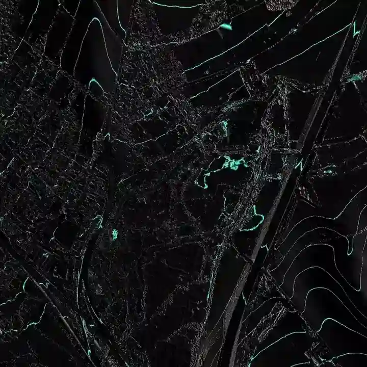

# Experimental Geographical Visualisations

This is a personal project that I work on from time to time, there are various different directions in which I would like to take this in future - some more practical and others more artistic (I hope with some value in hybrid forms and symbiosis between the two).

In its current form, it is somewhat demanding of the computer it runs on to render the graphics, which are based on high-resolution digital surface models. The data it uses is based on freely available sources from DEFRA (currently only covering a small area around Winchester as it requires laborious manual downloading followed by post-processing to make it suitable for rendering) and Ordnance Survey. You'd probably need to talk to me to get it set up (although I should make a public website, with less demanding graphic modes, at some point soon).

## Animated contours
Simple adaptation of the rendering that reveals features of the landscape in a unique and interesting way:

In this animation you can see distinctive patterns from sinuous rolling hills fractured by the long and deep scar of a motorway, watermeadows with sprawling fractal tributuries, rectilinear patterns in ploughed fields, woodland, housing, hedgerows...

This type of rendering could be incorporated in a subtler form to a more traditional and recognisable form of map.

## Viewshed
This is a common feature of specialist GIS software, but one that I think could have much more mainstream interest if it were properly presented.

The current implementation is able to follow a path recorded as a `GPX` tracklog, using a shadow-casting light source to visualise what would be visible along that journey. The feature needs some development, but should compare favourably to other implementations (as well as having other novel additions and applications that I have in mind). With a fair wind of accurate GPS data behind it, the combination of high-res heightfield and realtime viewshed analysis could allow depiction of features such as the moment a view opens through a gap in a hedgerow.

This visualisation is currently rather glitchy particularly as a result of using the elevation data as recorded in a `GPX` file, which is highly inaccurate; I base it on the height of the ground plus some offset. The quality of GPS data will still be a limiting factor, unfortunately.