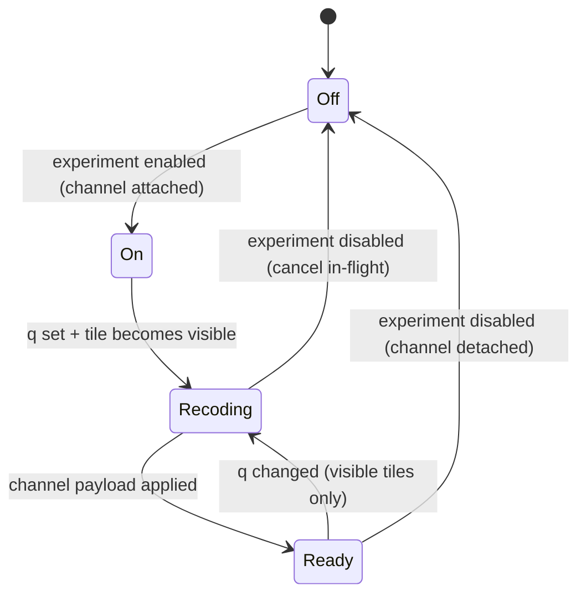

# Compression experiment

The HTJ2K compression experiment is the first concrete consumer of the raster-channel model proposed in [tile-layers.md](tile-layers.md). This doc describes what it is today, what is broken or incoherent about it, what it should look like once it is a channel, and the sequenced migration that gets it there.

No code changes here; this is the contract for the migration PRs.

## Related docs

- [docs/tile-layers.md](tile-layers.md) — the API and lifecycle this experiment will move onto.
- [docs/future-terrain.md](future-terrain.md) — direction, mentions the experiment in the auxiliary-channels section.
- [docs/server-side.md](server-side.md) — pipeline view (the offline encode of `/tile/` and `/ltile/` JP2s that this experiment re-encodes at runtime).

## 1. What the experiment is

Runtime HTJ2K re-encode of DEFRA height tiles at a chosen quality `q`, compared to the original encode; the shader blends a "full" height texture and a "lossy" recoded height texture so the user can see compression artefacts directly on the terrain. Practical purpose: investigate how aggressively heightfield rasters can be compressed before psychogeographically meaningful morphology disappears.

Where the pieces live today:

- The encoder call — `setQuality(false, q)` followed by encode / decode — in [public/texture_worker.js](../public/texture_worker.js) inside the worker's `recode` command.
- The blend shader — `mix`, `wave`, `split`, `deltaEmissive` modes — in [src/geo/TileShader.ts](../src/geo/TileShader.ts).
- The aggregate report and the worker-pool dispatch — `loadLossyForRecord`, `recordTileRecodeStats`, `startLossyRecode` — in [src/geo/compressionExperiment.ts](../src/geo/compressionExperiment.ts).
- The HTML panel (q slider, presets, aggregate stats, per-tile table) — [src/geo/CompressionAnalysisPanel.tsx](../src/geo/CompressionAnalysisPanel.tsx).
- The Leva enable toggle + status monitor — [src/geo/CompressionControls.tsx](../src/geo/CompressionControls.tsx).
- The Leva blend-mode + wave / delta knobs — [src/geo/TileShaderControls.tsx](../src/geo/TileShaderControls.tsx) (the "Compression blend" folder).
- Per-tile registration — `registerCompressionTile` invoked from [src/geo/LodUtils.ts](../src/geo/LodUtils.ts) inside `getTileMesh`.

## 2. Current state — what is broken or incoherent

Concrete, with file references:

### 2.1 DSM is never recoded

`getTileMesh` only registers a tile for recode when `lowRes && compressionOn` — see the `recodeUrl` assignment in [src/geo/LodUtils.ts](../src/geo/LodUtils.ts) (`const recodeUrl = lowRes && compressionOn ? getImageFilename(source, lowRes, true) : null;`, around line 86, and the matching `registerCompressionTile` call near line 175). `lowRes` is true only for the 10 m DTM tiles. The 1 m DSM is silently excluded despite the panel copy in [src/geo/CompressionAnalysisPanel.tsx](../src/geo/CompressionAnalysisPanel.tsx) saying "Runtime HTJ2K recode for DEFRA height tiles (DSM and 10m DTM)" (around line 105).

### 2.2 Recode set is whatever happened to be loaded

`registerCompressionTile` fires inside `getTileMesh` (line 175 in [src/geo/LodUtils.ts](../src/geo/LodUtils.ts)). When the user clicks _Start recode_, the experiment recodes whatever tiles were loaded before that point. Tiles loaded after Start are silently added to a running pipeline by the `loadStatus.recodePhase === 'running'` branch of `registerCompressionTile` ([src/geo/compressionExperiment.ts](../src/geo/compressionExperiment.ts) around line 269) — but the user has no way to know which tiles made it in.

### 2.3 Off-screen tiles still recode

The experiment iterates `trackedTiles` (a module-level `Set` at line 66 of [src/geo/compressionExperiment.ts](../src/geo/compressionExperiment.ts)). Every loaded tile is recoded, regardless of whether it is in the camera frustum. The q-slider therefore costs O(catalog), not O(viewport).

### 2.4 Quality-change UX is two-step and looks broken

`restartLossyRecodeAfterQualityChange` (around line 405 of [src/geo/compressionExperiment.ts](../src/geo/compressionExperiment.ts)) wipes state to `recodePhase: 'idle'` and asks the user to press _Start recode_ again. The panel's `applyQuality` callback (around line 51 of [src/geo/CompressionAnalysisPanel.tsx](../src/geo/CompressionAnalysisPanel.tsx)) calls it conditionally, so dragging the slider after a recode leaves the visible terrain looking like it has not responded — the height blend stays at the previous q until you find the button. This reads as a bug even though it is the documented flow.

### 2.5 One feature, three UI surfaces

The experiment is wired across three controls files:

- Enable toggle + status monitor in [src/geo/CompressionControls.tsx](../src/geo/CompressionControls.tsx).
- q slider, presets, aggregate stats, per-tile table in [src/geo/CompressionAnalysisPanel.tsx](../src/geo/CompressionAnalysisPanel.tsx).
- Blend mode + wave / delta knobs in [src/geo/TileShaderControls.tsx](../src/geo/TileShaderControls.tsx) under the "Compression blend" folder.

A user discovering the feature has to find all three.

### 2.6 Module-singleton state

`trackedTiles`, `lossyCompressionRatio`, `loadStatus`, `recodeReport` (lines 66–96 of [src/geo/compressionExperiment.ts](../src/geo/compressionExperiment.ts)) are module-level. Two consequences:

- HMR re-evaluation of the module would clobber live state, so the experiment quietly assumes the module is never reloaded.
- Two `TerrainRenderer` instances on the same page would share a single recode pipeline, which is wrong.

### 2.7 No unload on disable

`syncCompressionExperiment(false)` in [src/geo/compressionExperiment.ts](../src/geo/compressionExperiment.ts) (around line 436) calls `teardownLossyTextures()` but leaves `trackedTiles` intact. Re-enabling the experiment then reconstitutes the dual-height uniforms from a stale registration set. This works because re-enable is rare, not because it is correct.

### 2.8 Adjacent dead code

Not the experiment's fault, but in scope of the same refactor (and called out so the migration PR does not need to re-discover them):

- `renderMip()` body returns the input texture before doing any of its body work — [src/geo/LodUtils.ts](../src/geo/LodUtils.ts) lines 42–43.
- Sub-tile split path permanently disabled — `if (false && lod <= 3)` at line 115 of [src/geo/LodUtils.ts](../src/geo/LodUtils.ts).
- `planeBaseTest()` "not working" — [src/geo/TileLoaderUK.ts](../src/geo/TileLoaderUK.ts) lines 426–442.
- `LazyTileOS.rasterize()` empty stub — [src/geo/TileLoaderUK.ts](../src/geo/TileLoaderUK.ts) (the rasterize stub on `LazyTileOS`).

## 3. Target lifecycle

Under the channel model in [tile-layers.md](tile-layers.md), the experiment becomes a `RasterChannel<{ q: number }>` attached at experiment-enable time. The state surface collapses:

Key differences vs today:

- **"Start recode" button goes away.** Enabling the experiment attaches a `height.lossy` channel; q-changes call `manager.updateChannelParams('height.lossy', { q })`; visible tiles reconcile automatically. The slider is the trigger.
- **DSM and DTM are both supported.** The channel can be attached to whichever layer's tiles are in scope; there is no `lowRes &&` gate in the channel itself. If the user wants to scope it to one layer, that is a UI control, not a hardcoded condition.
- **Cancellation is uniform.** The channel's `load(ctx)` accepts the manager-supplied `AbortSignal`; per-record `lossyGeneration` counters go away.
- **Off-screen tiles cost nothing on q-change.** They reconcile when they next become visible.
- **The aggregate report covers _what the user has seen_.** The per-tile table includes an "off-screen, not yet recoded" status for catalog tiles that the channel has not yet been asked to load. Honest measurement instead of pretending the catalog is the workload.

## 4. UI consolidation

Collapse the three surfaces into one panel:

- **Enable toggle** (moved out of the Leva _Compression_ folder, into the panel header).
- **q slider** with presets — drives the channel params directly. No "Start" button.
- **Blend mode** (`mix` / `wave` / `split` / `deltaEmissive`) and blend amount — moved out of [src/geo/TileShaderControls.tsx](../src/geo/TileShaderControls.tsx). The other knobs there (contour speed / interval / strength, LOD hue, height emissive) are unrelated to the experiment and stay in the Terrain-shader folder.
- **Aggregate stats** and **per-tile table** — as today, but with a "visible / off-screen / failed" status column and total counts that distinguish "tiles measured" from "catalog size".

The Leva _Compression_ folder disappears. The Leva _Compression blend_ folder disappears. The HTML panel becomes the only surface, and the experiment is discoverable via a single entry point.

## 5. Migration plan

Numbered, scoped steps for follow-up PRs. Each step is small enough to ship and revert independently; together they implement the target above without a flag day.

1. **Introduce the channel API skeleton.** Land `RasterChannel`, `TileNode`, `TileLayerManager` interfaces as proposed in [tile-layers.md](tile-layers.md) § _API sketch_. Done as a type-only skeleton in [src/geo/tileLayerTypes.ts](../src/geo/tileLayerTypes.ts); nothing consumes the manager yet.
2. **Move primary height onto a channel.** Refactor [src/geo/LodUtils.ts](../src/geo/LodUtils.ts) so `getTileMesh` produces a bare `TileNode` (geometry + LOD only) and the existing `heightFeild` uniform binding moves into a `height.primary` channel's `applyToTile`. Visibility wiring still flows through `LazyTile.onBeforeRender` for this step.
3. **Move lossy recode onto a channel.** Convert [src/geo/compressionExperiment.ts](../src/geo/compressionExperiment.ts) into a `height.lossy` channel factory + a slim report aggregator that subscribes to channel events. Delete `registerCompressionTile` from `getTileMesh`. Attach happens once at experiment-enable time, not per-tile.
4. **Wire the q slider directly to the channel.** Replace `setLossyCompressionRatio` + `restartLossyRecodeAfterQualityChange` with `manager.updateChannelParams('height.lossy', { q })`. Remove the _Start recode_ button. Quality-change is one-step.
5. **Consolidate UI.** Merge [src/geo/CompressionControls.tsx](../src/geo/CompressionControls.tsx), [src/geo/CompressionAnalysisPanel.tsx](../src/geo/CompressionAnalysisPanel.tsx), and the "Compression blend" folder of [src/geo/TileShaderControls.tsx](../src/geo/TileShaderControls.tsx) into one panel (`CompressionAnalysisPanel.tsx` is the natural surviving file). Remove the Leva _Compression_ and _Compression blend_ folders.
6. **Replace placeholder-based loading with manager-driven visibility.** Swap `LazyTile.onBeforeRender` in [src/geo/TileLoaderUK.ts](../src/geo/TileLoaderUK.ts) for `manager.observeVisibility(camera)` driven from the render loop, with explicit `becameVisible` / `becameInvisible` transitions. Off-screen tiles stop recoding.
7. **Delete dead adjacent code.** `renderMip()` body, `if (false && lod <= 3)` sub-tile split ([src/geo/LodUtils.ts](../src/geo/LodUtils.ts)), `planeBaseTest()` ([src/geo/TileLoaderUK.ts](../src/geo/TileLoaderUK.ts)), `LazyTileOS.rasterize()` stub ([src/geo/TileLoaderUK.ts](../src/geo/TileLoaderUK.ts)).
8. **Add a second channel to validate the API.** A pre-baked `height.aux.firstMinusLast` channel against a tiny sample dataset. Confirms the API generalises beyond the lossy-recode case and exercises payload sizing / extent metadata.

Each numbered step is small enough to be a single issue. Steps 1–4 are the critical path for fixing the experiment's UX; 5 makes it discoverable; 6 makes it cheap; 7–8 are tidy-up and confidence-building.
