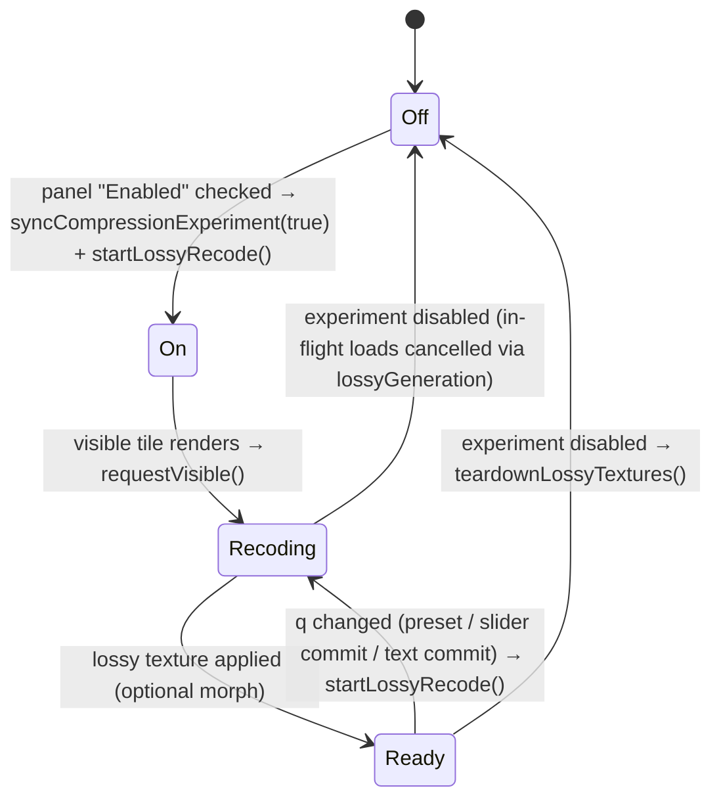
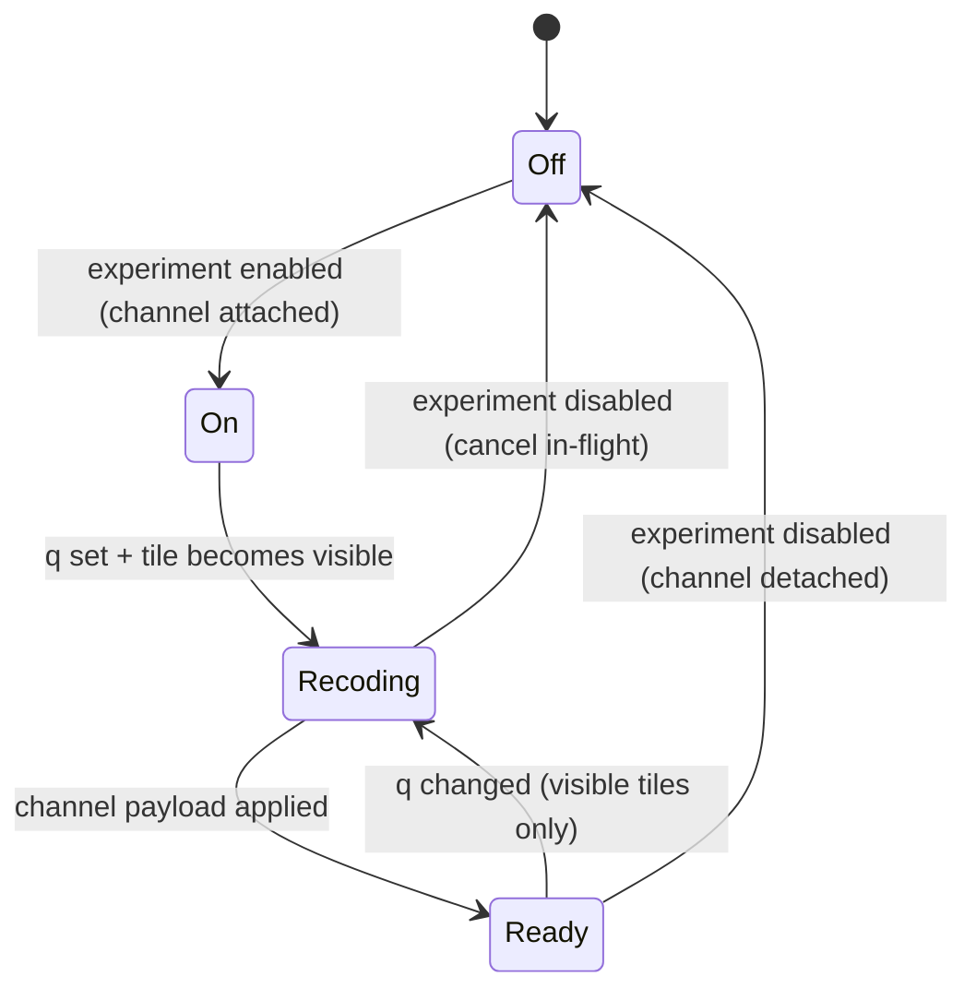

# Compression experiment

The HTJ2K compression experiment is the first concrete consumer of the raster-channel model proposed in [tile-layers.md](tile-layers.md). This doc describes what it is today, what has been fixed recently, what is still broken, what it should look like once it is a channel, and the sequenced migration that gets it there.

## Related docs

- [docs/tile-layers.md](tile-layers.md) — the API and lifecycle this experiment will move onto.
- [docs/future-terrain.md](future-terrain.md) — direction, mentions the experiment in the auxiliary-channels section.
- [docs/server-side.md](server-side.md) — pipeline view (the offline encode of `/tile/` and `/ltile/` JP2s that this experiment re-encodes at runtime).

## 1. What the experiment is

Runtime HTJ2K re-encode of DEFRA height tiles at a chosen quality `q`, compared to the original encode; the shader blends a "full" height texture and a "lossy" recoded height texture so the user can see compression artefacts directly on the terrain. Practical purpose: investigate how aggressively heightfield rasters can be compressed before psychogeographically meaningful morphology disappears.

Where the pieces live today:

- The encoder call — `setQuality(false, q)` followed by encode / decode — in [public/texture_worker.js](../public/texture_worker.js) inside the worker's `recode` command.
- The blend shader — `mix`, `wave`, `split`, `deltaEmissive` modes — in [src/geo/TileShader.ts](../src/geo/TileShader.ts).
- Tile tracking, visibility-gated recode dispatch, aggregate report — `registerCompressionTile`, `requestVisible`, `startLossyRecode`, `loadLossyForRecord`, `recordTileRecodeStats` — in [src/geo/compressionExperiment.ts](../src/geo/compressionExperiment.ts).
- The HTML panel (enable toggle, q slider, presets, blend controls, aggregate stats, per-tile table) — [src/geo/CompressionAnalysisPanel.tsx](../src/geo/CompressionAnalysisPanel.tsx), mounted from [src/App.tsx](../src/App.tsx).
- Per-tile registration and visibility hook — `registerCompressionTile` + `onBeforeRender → requestVisible()` in [src/geo/LodUtils.ts](../src/geo/LodUtils.ts) inside `getTileMesh`.

## 2. Current lifecycle (as implemented)

Enabling the experiment and changing quality are both one-step; there is no _Start recode_ button.

**Enable.** Checking _Enabled_ in the panel calls `syncCompressionExperiment(true)` then `startLossyRecode()`. The shader dual-height path activates immediately; visible tiles begin recoding on their next `onBeforeRender`.

**Quality change.** Presets and the quality text field commit immediately (`applyQuality`). The q slider previews while dragging and commits on pointer-up / arrow-key release (`commitCurrentQuality`). Each commit updates the module-level ratio and calls `startLossyRecode()`, which resets all tile phases to `idle` and starts a new recode epoch.

**Visibility gating.** Recode work is driven by `mesh.onBeforeRender → compressionHandle.requestVisible()`. A tile is "alive" while it has rendered recently (`TILE_ALIVE_GRACE_MS`, 1.5 s). Only alive tiles are counted in load status and enqueued for recode. Off-screen tiles are not recoded until they become visible again.

**Registration.** Every height tile loaded through `getTileMesh` registers for recode — both 1 m DSM (`/tile/…`) and 10 m DTM (`/ltile/…`). There is no longer a `lowRes &&` gate on registration.

**UI surface.** Compression controls live in a single HTML panel: enable toggle, q slider + presets, blend mode + blend amount + wave/delta knobs, aggregate stats, per-tile table. The former Leva _Compression_ folder ([CompressionControls.tsx](../src/geo/CompressionControls.tsx)) and _Compression blend_ folder in [TileShaderControls.tsx](../src/geo/TileShaderControls.tsx) are gone; terrain-shader Leva knobs (contours, LOD hue, height emissive) remain in _Terrain shader_.

## 3. Height formats and recode paths

The worker distinguishes two recode paths in `recode()` ([texture_worker.js](../public/texture_worker.js)):

| Layer | Fetch URL | Offline source | Runtime display | Recode path |
|-------|-----------|----------------|-----------------|-------------|
| **10 m DTM** | `/ltile/{idx}_{idx}-4096-32bit.j2c` | Float32 GeoTIFF windows → HTJ2K | `/ttile/` GeoTIFF extract → half-float **metres** (fast path when experiment off) | **DTM branch** when `heightRangeMetres` is supplied: denormalise uint16 codebook → metres, encode, decode, convert back to half-float metres, upsample if half-res, **quadrant-mirror repair** |
| **1 m DSM** | `/tile/{asc_stem}_normalised_rate0.j2c` | Float32 asc windows → normalised uint16 HTJ2K | Worker `decodeTex`: uint16 codebook → half-float **normalised 0…1**; shader `mapHeight()` uses catalog `min_ele` / `max_ele` | **Generic branch**: encode/decode uint16 codebook, `toHalf(v / 65536)` — **no upsample, no mirror repair** |

Important nuance: DSM tiles served at runtime are **per-tile normalised uint16**, not float32. Float32 is the offline survey source; [scripts/transcodeNormalise.js](../scripts/transcodeNormalise.js) produces the `_normalised_rate0.j2c` files under `/tile/`. The generic recode path is therefore structurally correct for DSM _encoding_, but it does not include the lossy-decode artefact repair that the DTM branch has.

For DTM recode, `getTileMesh` estimates `heightRangeMetres` by sampling the `/ttile/` display texture ([LodUtils.ts](../src/geo/LodUtils.ts)). For DSM, no metre range is passed — the shader already owns denormalisation via `heightMin` / `heightMax` uniforms from the catalog.

## 4. What is still broken or incomplete

### 4.1 DSM lossy decode artefacts (known bug)

DSM recode runs and produces a lossy texture, but the result is often visibly wrong: a **2×2 quadrant pattern** within each tile — duplicated columns and rows where the northern half carries the meaningful variation and the southern half is a muted copy. This matches the half-resolution / quadrant-mirror failure mode that lossy HTJ2K decode exhibits on height rasters.

The DTM branch detects and repairs this (`quadrantMirrorScore`, `repairLossyDtmTex`, upsampling in [texture_worker.js](../public/texture_worker.js)). The DSM generic branch does not. Fixing DSM likely means either:

- Extending mirror repair + upsampling to the generic path (output stays normalised 0…1 half-float), or
- Routing DSM through a variant of the DTM path that converts via catalog `min_ele` / `max_ele` and writes half-float metres (would require aligning shader uniform conventions with DTM).

Separately, if any tiles are still served as raw float32 JP2 (not the normalised uint16 `/tile/` files), the generic path would misinterpret sample values entirely — worth confirming against the actual files on disk.

### 4.2 DTM recode correctness (needs validation)

The DTM branch has substantial special-casing (metre range estimation, denormalise/re-normalise, upsample, mirror repair). It may still be wrong or fragile — see [NOTES.md](../NOTES.md) ("pipeline is incorrect for float32 data"). Whether 10 m DTM recode **looks** correct in the blend shader and whether aggregate RMSE numbers are trustworthy needs explicit confirmation.

### 4.3 Module-singleton state

`trackedTiles`, `lossyCompressionRatio`, `loadStatus`, `recodeReport` in [compressionExperiment.ts](../src/geo/compressionExperiment.ts) remain module-level. HMR re-evaluation would clobber live state; two `TerrainRenderer` instances on one page would share one pipeline.

### 4.4 Stale registration on disable

`syncCompressionExperiment(false)` calls `teardownLossyTextures()` but leaves `trackedTiles` intact. Re-enabling reconstitutes dual-height uniforms from the stale set. Works in practice because disable/re-enable is rare.

### 4.5 Aggregate report scope

The per-tile table only lists tiles that have **completed** a recode in the current epoch. There is no "tracked / visible / off-screen / not yet recoded" status column; totals do not distinguish catalog size from measured workload.

### 4.6 Progress can appear stuck

If no tiles are alive (nothing in view) or all visible tiles are in `ready`/`failed`/`loading` phase from a prior epoch, status strings can read as idle/waiting even though the user expects movement. The phase gate in `requestLossyForVisibleRecord` only loads tiles in `idle` phase until the next `startLossyRecode()`.

## 5. Target lifecycle (channel model)

Under the channel model in [tile-layers.md](tile-layers.md), the experiment becomes a `RasterChannel<{ q: number }>` attached at experiment-enable time. Much of today's UX is already aligned with the target:

- q slider is the trigger (done).
- Visible-tile-only recode (done, via `onBeforeRender` + alive grace — manager-driven visibility in step 6 of the migration plan would replace this hook).
- Single panel surface (done).

Still to migrate:

- Replace `registerCompressionTile` per-tile calls with a channel factory attached once at enable time.
- Replace `lossyGeneration` counters with manager-supplied `AbortSignal`.
- Collapse module singletons onto the manager + channel instances.
- Honest report with visible / off-screen / failed status per catalog tile.

## 6. Migration plan

Numbered steps for follow-up PRs. Steps marked **done** reflect the current branch; others are still open.

1. **Introduce the channel API skeleton.** **Done** — type-only skeleton in [src/geo/tileLayerTypes.ts](../src/geo/tileLayerTypes.ts).
2. **Move primary height onto a channel.** Refactor [src/geo/LodUtils.ts](../src/geo/LodUtils.ts) so `getTileMesh` produces a bare `TileNode` and `height.primary` channel owns the `heightFeild` uniform binding.
3. **Move lossy recode onto a channel.** Convert [src/geo/compressionExperiment.ts](../src/geo/compressionExperiment.ts) into a `height.lossy` channel factory + report aggregator. Delete per-tile `registerCompressionTile` from `getTileMesh`.
4. **Wire the q slider directly to the channel.** Replace `setLossyCompressionRatio` + `startLossyRecode` with `manager.updateChannelParams('height.lossy', { q })`. **Partially done** — slider already triggers recode without a button; still module-singleton, not channel params.
5. **Consolidate UI.** **Done** — single [CompressionAnalysisPanel.tsx](../src/geo/CompressionAnalysisPanel.tsx); Leva compression folders removed.
6. **Replace placeholder-based loading with manager-driven visibility.** Swap `onBeforeRender` hooks for `manager.observeVisibility(camera)`. **Partially done** — visibility gating exists via alive grace, but still per-mesh `onBeforeRender`, not manager-driven.
7. **Fix DSM (and validate DTM) recode pipeline.** Extend worker recode to handle DSM lossy-decode artefacts; confirm float32 → normalised uint16 assumptions match deployed tiles. Likely precedes or accompanies step 3.
8. **Delete dead adjacent code.** Sub-tile split, `planeBaseTest`, `LazyTileOS.rasterize()` stub — see [TileLoaderUK.ts](../src/geo/TileLoaderUK.ts) (status varies; re-audit before deleting).
9. **Add a second channel to validate the API.** Pre-baked `height.aux.firstMinusLast` against a tiny sample dataset.

Steps 2–4 and 7 are the critical path for a trustworthy experiment; 6 and 9 are polish and confidence-building.
