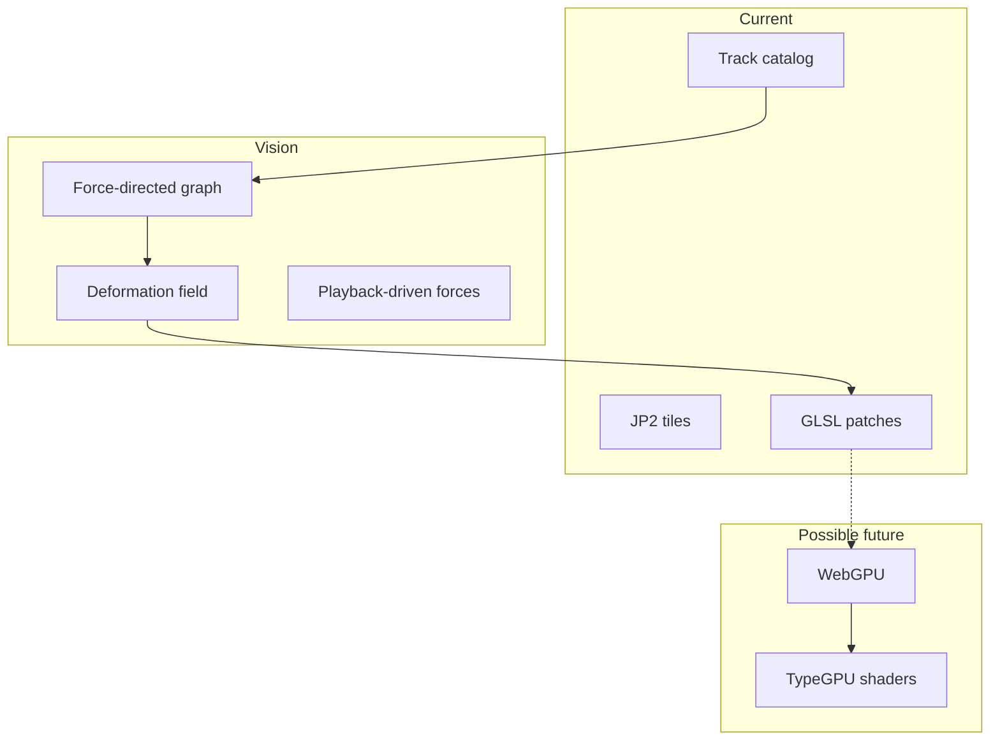

# Future terrain and rendering

Rough architecture notes for psychogeo beyond the current WebGL2 / Three.js heightfield stack. Not a commitment or implementation spec.

## Related docs

- [docs/tile-layers.md](tile-layers.md) — proposed in-browser raster-channel API and tile lifecycle that replaces today's ad-hoc per-tile state.
- [docs/compression-experiment.md](compression-experiment.md) — current state of the HTJ2K compression experiment and how it migrates onto the channel API.
- [docs/server-side.md](server-side.md) — offline data-processing pipelines, dev UI for controlling them, runtime backend, RSC evaluation, and a future Zarr storage evaluation.

## Current stack

- JP2 height tiles (DEFRA DSM/DTM) decoded in the browser.
- Attribute-less mesh: vertex positions from `gl_VertexID` + height texture in `onBeforeCompile` patches on `MeshStandardMaterial`.
- Per-tile `GeoLOD` with multiple geometric resolutions.
- Track catalog overlays (GPX) on the same scene.
- Shared `tileShaderUniforms` bus for Leva tuning and a stable `tileShaderRuntime` for shader HMR.

## Target vision: psychogeographic memory graph

Tracks and places from the catalog feed a **force-directed graph**: nodes (junctions, named places, repeated visits), edges (sequence, co-occurrence, similarity). During **playback**, forces deform the terrain representation—tiles or regions pulled toward graph layout, as a spatial model of memory and perception.

This needs either:

- Mutable vertex positions on the heightfield mesh, or
- A **low-resolution displacement / warp field** composited with the height sample in shader or compute.

The engine must own that deformation end-to-end; it is not a standard “terrain tile + vector overlay” workflow.

## Why a bespoke engine (for now)

Wider comparison across the criteria that actually decide this for psychogeo. Today is three.js + R3F on WebGL2; the realistic forward path is three.js + WebGPU (see § _Possible render path_).

| Criterion | MapLibre + deck.gl Terrain3D | Cesium | three.js + R3F (today) | three.js + WebGPU (target) |
|-----------|------------------------------|--------|------------------------|----------------------------|
| Graph-driven deformation of heightfield | Tile lifecycle and `TerrainLayer` not built for per-frame deformation | Globe-centric pipeline; deformation against quantized-mesh terrain non-trivial | Direct — bespoke shader, full vertex control via `onBeforeCompile` | Direct — typed compute + WGSL passes |
| Custom shaders / GPU compute | deck.gl custom layers possible but live separately from the terrain layer | Material system differs from raw GLSL; harder to share knobs | Native — `onBeforeCompile` + `tileShaderRuntime` | Native — single typed pipeline (e.g. TypeGPU) |
| Lazy per-tile raster channels (height variants, aux, photo) | `TerrainLayer` expects standard tile schema; attaching aux rasters per-tile is off-grid | Imagery providers plug into globe tiling, not arbitrary channels | Compression experiment implements dual-height + visibility-gated recode; DSM lossy path still buggy; needs channel API (see [tile-layers.md](tile-layers.md)) | Same pattern; compute passes could decode in-place |
| OSGB-ish flat grid + local Z-up | Good for 2D map + extrusion; flat grid OK | Globe-shaped; flat-projection mode is limited | Native | Native |
| WebGPU path | deck.gl WebGPU is work-in-progress; not the default | Cesium WebGPU is work-in-progress | Not yet; current build is WebGL2 | This _is_ the target |
| Mobile fit | Strong — MapLibre is mobile-first | Heavy on memory and bundle size | Workable; LOD bias + control tuning required | Same; gated on WebGPU mobile availability |
| Ecosystem maturity | Mature (MapLibre) + active (deck.gl) | Mature, large org backing | Very mature (three.js); R3F mature | New — TypeGPU and WebGPU shaders less battle-tested |
| Getting-started cost from here | Significant rewrite — current shader and tile pipeline do not map onto deck.gl's layer model | Major rewrite; globe model is the wrong fit | Already here | Incremental from current — replace `onBeforeCompile` patches with a WGSL pipeline |

**When to reconsider**

- Mostly **2D psychogeography** on fixed terrain → deck.gl + MapLibre may be enough.
- **Globe-scale** exploration with photorealistic terrain → Cesium.
- Stay bespoke if deformation, memory graph, and heightfield LOD stay central.

## Possible render path: WebGPU and TypeGPU

- Replace `onBeforeCompile` string patching with **typed WGSL** (e.g. TypeGPU): height sample, normals, contour/emissive in one maintainable pipeline.
- Height decode (JP2) may stay on CPU or move to compute upload.
- Migration sketch: keep `tileShaderUniforms` schema and `installTileShaderImpl`; swap implementation from Three GL2 patches to WebGPU render/compute passes.
- R3F may remain as a thin React shell or give way to a single canvas + explicit render graph.

## Force-directed graph (sketch)

- **Nodes**: track waypoints clustered, catalog place names, manual anchors.
- **Edges**: time-ordered segments, spatial proximity, shared place.
- **Forces**: spring (edge length), repulsion, optional anchor to true geography.
- **Coupling to terrain**: per-tile control points or shared warp texture; update each frame during playback; optional persistence of layout between sessions.

## Auxiliary height channels

Beyond primary DSM/DTM height tiles, the pipeline may carry **auxiliary rasters** baked offline. One candidate is the **first-return minus last-return** DSM difference: a sparse, low-bit-depth, aggressively compressed field encoding vertical structure in vegetation and built form. Unlike runtime JP2 recompression experiments (gated `compressionExperimentEnabled` in the app — synthetic loss from re-encoding the same DSM), this is real survey signal. Possible uses include approximating **partial shade**, canopy penetration, or modulating emissive/contour response without replacing the main height displacement. Format and resolution TBD; likely much coarser than 4096² full DSM. The tile loader should treat primary height and aux channels as separate optional layers behind a small provider API, not as special cases of j2c decode.

## Viewshed roadmap

The near-term manual viewshed source still uses Three.js point-light shadow maps over the flat OSGB terrain model. That is useful for interaction and debugging, but mountain-scale "what can I see from here?" needs a more explicit viewshed pipeline.

- **Shadow-map precision first.** Keep point-light shadows adjustable by radius and map size, and bake them when the source is stable. Large far planes should be treated as a quality tradeoff, not a hidden default.
- **Curvature / geoid experiment.** Preserve flat OSGB tile geometry and camera controls, but add a shadow-only vertex transform relative to the viewshed source. Start with an effective Earth radius parameter, optionally including atmospheric refraction, and compare against the flat pass.
- **Beyond one point-light shadow.** True mountain-top visibility can exceed a single practical cube-shadow range. Candidate approaches include cascaded radial shadow shells, custom horizon-angle buffers, two-step depth passes, logarithmic depth, or a bespoke heightfield viewshed pass.
- **Light-driven LOD.** Terrain detail needed by the viewshed source should become a first-class tile visibility signal. The renderer camera is not the only consumer of procedural geometry; shadow cameras and future analysis passes need their own working-set and LOD requests.
- **Debuggability.** Keep source position, eye height, shadow radius, shadow camera near/far, map size, and selected LOD levels visible in the app debug snapshot so future quality regressions can be reproduced without visual guesswork.

## Routing and mobile (sketch)

Today's [src/App.tsx](../src/App.tsx) mounts a single full-viewport view with Leva controls and side panels. Two natural follow-ups, sketched here only:

**Routing.** Split the app into distinct surfaces, each owning its own panel chrome:

- `/abstract` — current psychogeographic-graphics default (animated contours, viewshed playback). Carries the experimental shader knobs.
- `/map` — navigable basemap → DSM morph (see [tile-layers.md](tile-layers.md) § _Basemap morph_) for orientation and place-finding. Foreground audience for non-expert users.
- `/tracks` — track catalog browser; today's `TrackCatalogPanel` is the seed.

Stay single-page for now. Introduce `react-router` once any two surfaces have distinct chrome. The renderer cache in [src/TerrainContext.ts](../src/TerrainContext.ts) already supports multiple coordinates so route-scoped views are feasible without redesigning the terrain layer.

**Mobile.** A usable mobile build needs, in roughly priority order:

- Touch-first camera controls — extend [src/camera/MapCameraControls.ts](../src/camera/MapCameraControls.ts) (or its successor) with single-finger pan + two-finger pinch / rotate.
- Collapsible / drawer-style chrome — Leva is desktop-shaped; wrap or replace it with a single bottom-sheet panel.
- Lower default LOD bias and a smaller working set to fit phone GPU-memory budgets; informed by the working-set budget concept in [tile-layers.md](tile-layers.md) § _Visibility model_.
- Disable the compression experiment on mobile by default — it doubles GPU height-texture memory.

Detailed wiring belongs in its own doc once a non-experimental surface (probably `/map`) is the immediate target.

## Open questions

- Deform full 4096²-equivalent mesh vs coarse warp field updated at 64²–256²?
- One global graph vs regional graphs per tile cluster?
- How much geographic truth to preserve vs abstract memory layout?
- Persistence format for graph state and deformation parameters.
