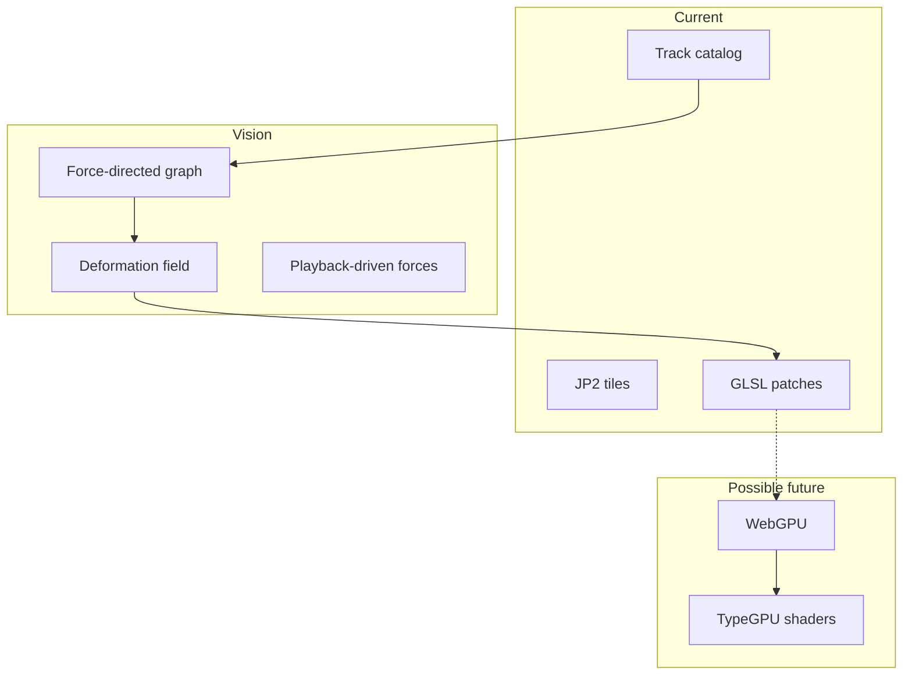

# Future terrain and rendering

Rough architecture notes for psychogeo beyond the current WebGL2 / Three.js heightfield stack. Not a commitment or implementation spec.

## Current stack

- JP2 height tiles (DEFRA DSM/DTM) decoded in the browser.
- Attribute-less mesh: vertex positions from `gl_VertexID` + height texture in `onBeforeCompile` patches on `MeshStandardMaterial`.
- Per-tile `GeoLOD` with multiple geometric resolutions.
- Track catalog overlays (GPX) on the same scene.
- Shared `tileShaderUniforms` bus for Leva tuning and a stable `tileShaderRuntime` for shader HMR.

## Target vision: psychogeographic memory graph

Tracks and places from the catalog feed a **force-directed graph**: nodes (junctions, named places, repeated visits), edges (sequence, co-occurrence, similarity). During **playback**, forces deform the terrain representation—tiles or regions pulled toward graph layout, as a spatial model of memory and perception.

This needs either:

- Mutable vertex positions on the heightfield mesh, or
- A **low-resolution displacement / warp field** composited with the height sample in shader or compute.

The engine must own that deformation end-to-end; it is not a standard “terrain tile + vector overlay” workflow.

## Why a bespoke engine (for now)

| Need | Bespoke fit | deck.gl / MapLibre | Cesium |
|------|-------------|-------------------|--------|
| Procedural height from texture + `gl_VertexID` | Native | `TerrainLayer` expects height maps / mesh conventions | Quantized mesh terrain |
| Graph-driven deformation | Direct | Fighting tile lifecycle and LOD | Globe-centric pipeline |
| UK OSGB-ish flat grid + local Z-up | Current model | Good for 2D map + extrusion | Good for globe |
| Live shader + uniform iteration | `tileShaderRuntime` | Custom layers possible but separate from terrain | Material system differs |

**When to reconsider**

- Mostly **2D psychogeography** on fixed terrain → deck.gl + MapLibre may be enough.
- **Globe-scale** exploration with photorealistic terrain → Cesium.
- Stay bespoke if deformation, memory graph, and heightfield LOD stay central.

## Possible render path: WebGPU and TypeGPU

- Replace `onBeforeCompile` string patching with **typed WGSL** (e.g. TypeGPU): height sample, normals, contour/emissive in one maintainable pipeline.
- Height decode (JP2) may stay on CPU or move to compute upload.
- Migration sketch: keep `tileShaderUniforms` schema and `installTileShaderImpl`; swap implementation from Three GL2 patches to WebGPU render/compute passes.
- R3F may remain as a thin React shell or give way to a single canvas + explicit render graph.

## Force-directed graph (sketch)

- **Nodes**: track waypoints clustered, catalog place names, manual anchors.
- **Edges**: time-ordered segments, spatial proximity, shared place.
- **Forces**: spring (edge length), repulsion, optional anchor to true geography.
- **Coupling to terrain**: per-tile control points or shared warp texture; update each frame during playback; optional persistence of layout between sessions.

## Auxiliary height channels

Beyond primary DSM/DTM height tiles, the pipeline may carry **auxiliary rasters** baked offline. One candidate is the **first-return minus last-return** DSM difference: a sparse, low-bit-depth, aggressively compressed field encoding vertical structure in vegetation and built form. Unlike runtime JP2 recompression experiments (gated `compressionExperimentEnabled` in the app — synthetic loss from re-encoding the same DSM), this is real survey signal. Possible uses include approximating **partial shade**, canopy penetration, or modulating emissive/contour response without replacing the main height displacement. Format and resolution TBD; likely much coarser than 4096² full DSM. The tile loader should treat primary height and aux channels as separate optional layers behind a small provider API, not as special cases of j2c decode.

## Open questions

- Deform full 4096²-equivalent mesh vs coarse warp field updated at 64²–256²?
- One global graph vs regional graphs per tile cluster?
- How much geographic truth to preserve vs abstract memory layout?
- Persistence format for graph state and deformation parameters.
