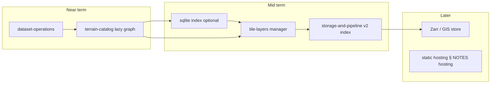

# Planning index

Next-step planning derived from [NOTES.md](../../NOTES.md) § _Managing datasets_ and related architecture docs. These are contracts and sequencing guides, not implementation specs.

## Documents

| Doc | Scope |
|-----|--------|
| [dataset-operations.md](dataset-operations.md) | Configurable data roots, dev proxy, dataset registry, pipeline job UI |
| [terrain-catalog-and-lod.md](terrain-catalog-and-lod.md) | Hierarchical index, lazy tile scene graph, geometric LOD vs raster pyramid |
| [storage-and-pipeline-v2.md](storage-and-pipeline-v2.md) | Pipeline v2 on DEFRA or existing outputs, zarr-image levels, **segment files + HTTP Range**, GIS ecosystem, index slimming |
| [sqlite-catalog.md](sqlite-catalog.md) | SQLite for ops registry and/or per-dataset terrain index (vs JSON shards / quadtree) |

## Existing architecture (read alongside)

- [docs/tile-layers.md](../tile-layers.md) — in-browser channel lifecycle, visibility, working-set eviction (target runtime model).
- [docs/server-side.md](../server-side.md) — backend, dev pipelines UI sketch, Zarr evaluation checklist.
- [docs/future-terrain.md](../future-terrain.md) — rendering vision, basemap morph, routing / mobile.
- [docs/compression-experiment.md](../compression-experiment.md) — runtime HTJ2K recode; first consumer of tile-layer API.

## Problem summary (from notes)

Today the app:

1. Resolves terrain data through hard-coded paths in [src/start-server.js](../../src/start-server.js) and Leva defaults in [src/App.tsx](../../src/App.tsx).
2. Fetches every shard listed in `manifest.json`, merges into one in-memory catalog ([src/geo/terrainDatasetCatalog.ts](../../src/geo/terrainDatasetCatalog.ts)), then instantiates a `LazyTile` per entry ([src/geo/TileLoaderUK.ts](../../src/geo/TileLoaderUK.ts) `makeTiles`).
3. Loads height textures on first `onBeforeRender` with no uniform abort when tiles leave the frustum; zoomed-out views still trigger many concurrent decodes → VRAM thrashing.
4. Stores per-tile metadata redundantly across channel records in multi-GB `index/` shards (pipeline: [scripts/pipelines/defra-terrain/](../../scripts/pipelines/defra-terrain/)).

The planning docs below break these into phased work that converges on the tile-layer and catalog models already sketched elsewhere.

## Suggested sequencing

1. **Dataset operations** — stop editing three files to point at a new dataset; unblocks national-scale ingest experiments.
2. **Catalog + LOD graph** — do not materialise the full tile set at startup; spatial queries + visibility-gated load (feeds tile-layers migration).
3. **Pipeline v2 + slimmer index** — incremental ingest, less redundant JSON, optional compat export.
4. **Storage migration** — Zarr or GIS-native only after (2) and (3) define what the runtime actually queries.
