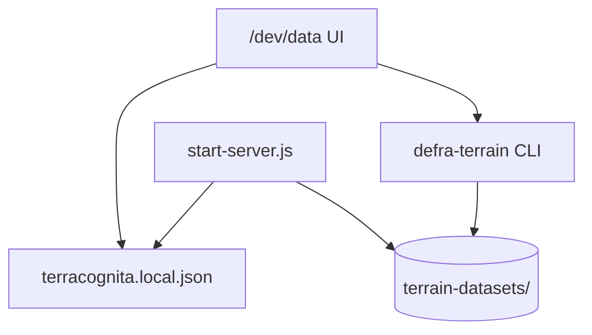

# Dataset operations and admin

How TerraCognita discovers, configures, and operates on terrain datasets and pipeline jobs in a dev / prototype context. Addresses [NOTES.md](../../NOTES.md): hard-coded proxy paths and a need for path management plus job visibility.

## Related docs

- [storage-and-pipeline-v2.md](storage-and-pipeline-v2.md) — what pipelines produce and how manifests are shaped.
- [sqlite-catalog.md](sqlite-catalog.md) — SQLite for ops registry and terrain tile index.
- [docs/server-side.md](../server-side.md) § _Dev UI for pipelines_ — RSC vs REST, `/dev/pipelines` recommendation.
- [README.md](README.md) — overall sequencing.

## Current state

| Concern | Where it lives today | Pain |
|---------|----------------------|------|
| Terrain dataset files on disk | `TERRACOGNITA_TERRAIN_DATASETS_ROOT` commented out; hard-coded `/Volumes/.../DEFRA/` in [src/start-server.js](../../src/start-server.js) | Machine-specific; not in repo |
| Legacy tile URLs | `MAPSYNTH_GIS_ROOT` + `/tile`, `/ltile`, `/os`, `/gpx` routes in same file | Same |
| Active dataset in UI | Leva `terrainDatasetManifestUrl` in [src/App.tsx](../../src/App.tsx) | Another place to edit |
| Pipeline runs | CLI only: `pnpm --dir scripts defra` → [scripts/pipelines/defra-terrain/cli.ts](../../scripts/pipelines/defra-terrain/cli.ts) | No status UI, no promote flow |
| Dataset schema | `psychogeo.terrain.v1` manifest + shards ([scripts/pipelines/defra-terrain/types.ts](../../scripts/pipelines/defra-terrain/types.ts)) | Good direction; ops layer missing; schema prefix unchanged for existing data |

The v1 terrain dataset path (`/terrain-datasets/.../manifest.json`) is the forward-looking contract. Legacy `/tile` paths remain for older baked tiles and DTM layers until migrated.

## Goals

1. **One configuration surface** for roots, active dataset, and optional legacy fallbacks — env + local override file, not scattered string literals.
2. **Dataset registry** — list installed datasets (id, bounds, channels, byte stats from manifest), pick active without recompiling.
3. **Job-oriented pipeline UX** — trigger ingest, watch progress, inspect failures, promote a version (aligns with [server-side.md](../server-side.md) § 3).
4. **Production path stays thin** — admin UI is dev-gated; runtime only needs manifest URL + channel id (already on `TerrainOptions`).

## Proposed configuration model

### Environment and local overrides

```ts
// Illustrative — not implemented
interface TerraCognitaDataConfig {
  gisRoot: string;                    // MAPSYNTH_GIS_ROOT
  terrainDatasetsRoot: string;        // directory of psychogeo.terrain.v1 datasets
  legacy?: {
    j2kTileFolder?: string;
    dtm10mFolder?: string;
    osTerr50Folder?: string;
    gpxFolder?: string;
  };
}
```

Resolution order: `terracognita.local.json` (gitignored) → env vars → documented defaults for CI / docs-only builds.

The proxy ([src/start-server.js](../../src/start-server.js)) reads this once at startup and logs resolved roots (already logs `gisRoot`; extend consistently).

### Dataset registry entry

Derived from each dataset's `manifest.json` (no second source of truth):

| Field | Source |
|-------|--------|
| `datasetId` | manifest |
| `manifestUrl` | constructed from registry root + relative path |
| `bounds` | manifest `bounds` |
| `channels` | manifest `channels[]` |
| `storage` | manifest `storage` stats |
| `promoted` | sidecar `current.json` or symlink `current` → dataset dir |

Promotion is the only mutating ops action that affects what the main app loads by default.

### Registry location (decision)

**Manifests and tile payloads stay on the operator machine** — under `terrainDatasetsRoot`, on external volumes, etc. They are not committed to the repo and are not checked in as part of the registry.

The repo carries only **portable hints**, not data:

| In repo | On operator machine |
|---------|---------------------|
| `terracognita.datasets.example.json` — shape of local config, no secrets | `terracognita.local.json` — real roots, active `manifestUrl` |
| Documented env vars (`MAPSYNTH_GIS_ROOT`, `TERRACOGNITA_TERRAIN_DATASETS_ROOT`) | Dataset directories (`…/LIDAR-DSM-DZ-2022-terracognita-defra-v1/manifest.json`, `tiles/`, `index/`) |
| Optional `datasets.lock.json` in repo listing *expected* `datasetId`s for CI smoke tests (manifest URLs still resolved locally) | Promotion sidecar (`current.json` or symlink) beside datasets |

At runtime the registry is a **scan of `terrainDatasetsRoot`**, not a git-tracked catalog. Switching machines means pointing config at a copy of the same tree (or re-running ingest there).

**Optional:** cache registry rows in a local **ops SQLite** (`catalog.db`) so dev UI and job history do not rescan every dataset on startup — see [sqlite-catalog.md](sqlite-catalog.md) § _Ops catalog schema_. Manifests on disk remain authoritative; the DB is a convenience layer.

### Low-friction data migration

Migration should not require re-downloading DEFRA or re-encoding HTJ2K unless the operator chooses to. Prefer **copy + re-point + optional reindex**.

| Scenario | Low-friction path |
|----------|-------------------|
| **New laptop / disk** | `rsync -a` (or Finder copy) the whole dataset directory; set `terrainDatasetsRoot` / `manifestUrl` in `terracognita.local.json`; promote if using `current` sidecar. |
| **New dataset version beside old** | Ingest to a sibling dir (`…-defra-v2/`); promote when validated; keep v1 until confident. No in-place overwrite of the only copy. |
| **Same blobs, slimmer index / schema tweak** | Pipeline `reindex` or `source=psychogeo-v1` (see [storage-and-pipeline-v2.md](storage-and-pipeline-v2.md)) — reads existing `tiles/`, writes new `index/` + manifest; payloads unchanged. |
| **JSON index → SQLite** | `index-to-sqlite` copies shard metadata into `index.db`; copy with dataset dir ([sqlite-catalog.md](sqlite-catalog.md)). |
| **Legacy `/tile` tree → v1 dataset** | One-off ingest or import script from old layout; document in migration notes when Winchester path is retired. |
| **Share with another developer** | Portable archive (tar/zstd of dataset dir) or shared NAS path; recipient drops under their `terrainDatasetsRoot` and copies example local config. Not via git. |
| **Future hosted tiles** | Export/publish step copies payloads + manifest to S3/CDN; local registry entry gets a `manifestUrl` that is either `file://…` or `https://…` — same manifest schema, different base URL ([storage-and-pipeline-v2.md](storage-and-pipeline-v2.md) § hosting). |

**Friction reducers** to implement with the registry work:

1. **`pnpm pipeline:defra reindex --from <dir>`** (or dedicated subcommand) — validate existing v1 layout, rewrite index/manifest only.
2. **Dev UI “Import dataset”** — pick a folder containing `manifest.json`, verify `schemaVersion`, register in local config (no copy).
3. **Health check** — given `manifestUrl`, HEAD sample tile hrefs and report missing files before promote.
4. **Example local config** committed as `terracognita.datasets.example.json` so a new machine is: copy data → copy example → edit two paths → run.

Schema prefix stays `psychogeo.terrain.*` until a deliberate version bump; migration tooling should accept that ID on read and write without renaming on-disk trees casually.

## Admin / prototype UI (sketch)

Dev-only route `/dev/data` (or combined with `/dev/pipelines` once pipelines exist):

| Panel | Actions |
|-------|---------|
| **Paths** | Show resolved config; edit via form writing `terracognita.local.json` (dev only) |
| **Datasets** | Table from registry scan; "Set active" → updates persisted preference consumed by App / proxy |
| **Jobs** | List pipeline runs (id, pipeline name, started, state, log tail); trigger new run with params from pipeline JSON schema |
| **Inspect** | Open manifest, sample shard, link to `dsm_catalog.compat.json` for debugging |

Backend options (unchanged from [server-side.md](../server-side.md)): start with filesystem scan + spawn CLI for jobs; later Node + Hono with job table if concurrent runs matter.



## Migration steps

1. **Extract paths** from `start-server.js` into a small `scripts/data-config.js` (or TS module shared with Vite env injection for manifest default).
2. **Registry scan** — read `terrainDatasetsRoot/*/manifest.json`, validate `schemaVersion`, expose `GET /api/datasets` when backend exists; until then, dev UI reads via Vite middleware or direct fs in dev script.
3. **Wire App** — `terrainDatasetManifestUrl` from registry / user preference instead of commented Leva options.
4. **Pipeline jobs** — wrap CLI with run id + log file; dev UI tails log (see [server-side.md](../server-side.md) progress JSON-lines).
5. **Deprecate** — document removal timeline for `/tile` once v1 datasets cover Winchester + next FOI extent.

## Open questions

- Ops registry: filesystem scan only at first, or SQLite ops catalog from phase 0? ([sqlite-catalog.md](sqlite-catalog.md))
- Auth: none for local dev; token for any future hosted admin?
- Single vs multiple active channels (DSM + DTM + aux) — today one `channelId` on `TerrainDatasetConfig`; registry should list available channels without implying all are loaded at once.

## Success criteria

- Pointing at a new national ingest output requires editing zero source files (only config + promote).
- Moving a dataset to another machine is copy + edit local config, without re-ingest.
- A new contributor can see which dataset is active and why a tile 404s (registry + proxy logs).
- Pipeline failure from a long ingest is inspectable without re-running blind.
