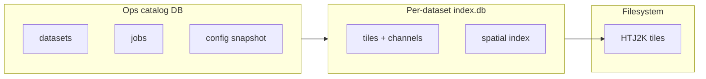

# SQLite for operations and terrain indexing

Evaluation of SQLite as a complement to on-disk HTJ2K payloads and `psychogeo.terrain.v1` JSON manifests. Not a commitment — a place to compare options before the multi-GB `index/` problem forces a format choice.

## Related docs

- [dataset-operations.md](dataset-operations.md) — operator-machine registry, jobs, migration.
- [terrain-catalog-and-lod.md](terrain-catalog-and-lod.md) — viewport queries, sparse tile graph.
- [storage-and-pipeline-v2.md](storage-and-pipeline-v2.md) — pipeline ingest, reindex, index slimming.

## Two separate databases (do not conflate)

| Database | Lives where | Purpose |
|----------|-------------|---------|
| **Ops catalog** | Beside `terracognita.local.json` (e.g. `~/.terracognita/catalog.db` or `terrainDatasetsRoot/.terracognita/catalog.db`) | Registered datasets, active/promoted pointers, pipeline job history, import health checks |
| **Terrain index** | Inside each dataset directory (e.g. `dataset/index.db`) | Per-tile spatial index, channel hrefs, encoding scalars — replaces or shadows `index/*.json` shards |

Payload bytes stay in `tiles/**/*.j2c`. SQLite holds **metadata and pointers only**, same as today's JSON shards.



Keeping them separate avoids coupling national terrain ingest to dev-machine job state, and lets you copy a dataset dir (including `index.db`) without dragging job logs.

## Why consider SQLite

| Problem today | SQLite angle |
|---------------|----------------|
| Multi-GB `index/` of redundant JSON | Normalised rows; one encoding row per channel; provenance in separate table or omitted from hot path |
| `loadTerrainDatasetCatalog` fetches every shard | `SELECT … WHERE east_min <= ? AND east_max >= ? AND …` or R-tree `intersects` — one round-trip if DB is local or served via range API |
| Registry = scan many `manifest.json` files | Single ops DB updated on import/promote; optional cache of manifest summary columns |
| Pipeline job visibility | `jobs` table with status, log path, params JSON |
| Migration between machines | Copy `index.db` + `tiles/` + slim `manifest.json`; ops DB re-import or separate copy |

## Where SQLite fits vs alternatives

| Approach | Best for | Weakness |
|----------|----------|----------|
| **JSON shards** (v1 today) | Simple static hosting, human inspection | Huge at national scale; no partial read without custom sharding |
| **Quadtree JSON files** ([terrain-catalog-and-lod.md](terrain-catalog-and-lod.md)) | CDN-friendly, no DB runtime | Still many HTTP requests; redundant if tree is deep |
| **SQLite index per dataset** | Local dev, single-file copy, fast spatial SQL | Browser cannot mmap host path; needs proxy API or sql.js download of *subset* |
| **Zarr + attrs** ([storage-and-pipeline-v2.md](storage-and-pipeline-v2.md)) | Raster-native multiscale | HTJ2K codec story; index for sparse tile grid still awkward |
| **Postgres + PostGIS** | Multi-user hosted backend | Heavy for solo operator-machine workflow |

**Pragmatic split:** keep a small **`manifest.json`** at dataset root for schema version, bounds, channel declarations, and `index.db` href — same role manifest has now, but `index.shards[]` becomes optional or a legacy export.

## Ops catalog schema (sketch)

```sql
-- terracognita ops catalog (~/.terracognita/catalog.db or under terrainDatasetsRoot)

CREATE TABLE datasets (
  dataset_id TEXT PRIMARY KEY,
  root_path TEXT NOT NULL UNIQUE,
  manifest_path TEXT NOT NULL,        -- manifest.json relative to root_path
  schema_version TEXT NOT NULL,
  bounds_json TEXT NOT NULL,          -- JSON TileExtent
  promoted_at TEXT,                   -- null if not active
  imported_at TEXT NOT NULL,
  storage_bytes INTEGER,
  notes TEXT
);

CREATE TABLE dataset_channels (
  dataset_id TEXT NOT NULL REFERENCES datasets(dataset_id),
  channel_id TEXT NOT NULL,
  role TEXT,
  resolution_metres REAL,
  PRIMARY KEY (dataset_id, channel_id)
);

CREATE TABLE pipeline_jobs (
  job_id TEXT PRIMARY KEY,
  pipeline_name TEXT NOT NULL,
  dataset_id TEXT,
  params_json TEXT,
  state TEXT NOT NULL,                -- queued | running | succeeded | failed
  started_at TEXT,
  finished_at TEXT,
  log_path TEXT,
  output_root TEXT
);

CREATE TABLE config (
  key TEXT PRIMARY KEY,
  value_json TEXT NOT NULL
);
-- keys: active_dataset_id, gis_root, terrain_datasets_root, ...
```

Populated by: dev UI import, CLI wrapper after ingest, health-check pass. **Not** committed to git.

## Terrain index schema (sketch)

```sql
-- inside dataset directory: index.db

CREATE TABLE tiles (
  tile_id TEXT PRIMARY KEY,
  source_tile_ref TEXT,
  east_min REAL NOT NULL,
  east_max REAL NOT NULL,
  north_min REAL NOT NULL,
  north_max REAL NOT NULL
);

CREATE TABLE tile_channels (
  tile_id TEXT NOT NULL REFERENCES tiles(tile_id),
  channel_id TEXT NOT NULL,
  href TEXT NOT NULL,                 -- relative to dataset root
  width INTEGER NOT NULL,
  height INTEGER NOT NULL,
  resolution_metres REAL NOT NULL,
  encoding_json TEXT NOT NULL,        -- min/max/offset/scale/kind
  bytes INTEGER,
  valid_percent REAL,
  PRIMARY KEY (tile_id, channel_id)
);

-- SQLite R-tree for OSGB bbox queries (easting/northing)
CREATE VIRTUAL TABLE tile_bounds USING rtree(
  id,                                 -- integer rowid mapping to tiles.rowid
  east_min, east_max,
  north_min, north_max
);
```

**Ingest:** pipeline bulk-inserts in a transaction, then `ANALYZE`. **Reindex:** rebuild `index.db` from existing `tiles/` without re-encoding.

**Export:** optional `export-json-shards` for debugging or static-only hosting; not the primary write path at national scale.

### Example viewport query

```sql
SELECT t.tile_id, t.east_min, t.north_min, c.channel_id, c.href, c.encoding_json
FROM tile_bounds b
JOIN tiles t ON t.rowid = b.id
JOIN tile_channels c ON c.tile_id = t.tile_id
WHERE b.east_min <= :eastMax AND b.east_max >= :eastMin
  AND b.north_min <= :northMax AND b.north_max >= :northMin
  AND c.channel_id = :channelId;
```

Frontend or proxy calls this instead of downloading all shard JSON files.

## Runtime access patterns

| Consumer | Suggested access |
|----------|------------------|
| **Node proxy** ([start-server.js](../../src/start-server.js)) | `better-sqlite3` (sync, simple) or `node:sqlite` (Node 22+) — open dataset `index.db` read-only; route `GET /terrain-datasets/.../tiles-in-bounds?…` |
| **Pipeline CLI** | Same driver, write mode during ingest |
| **Browser** | Prefer **HTTP bounds API** backed by SQLite on server; avoid shipping whole `index.db` to the client |
| **Browser (offline experiment)** | [sql.js](https://sql.js.org/) WASM only if index is small or subset is extracted; national DB is too large to download whole |

Aligns with [terrain-catalog-and-lod.md](terrain-catalog-and-lod.md) Phase 1: bounds query first; storage format behind the query is swappable (JSON shards today, SQLite tomorrow).

## Migration from v1 JSON index

Low-friction path (fits [dataset-operations.md](dataset-operations.md) § _Low-friction data migration_):

1. **`pnpm pipeline:defra index-to-sqlite --from <datasetDir>`** — read `manifest.json` + `index/*.json`, write `index.db`, leave JSON in place.
2. Add `manifest.index.mode: 'sqlite' | 'json-shards'` (default `json-shards` for old trees).
3. [terrainDatasetCatalog.ts](../../src/geo/terrainDatasetCatalog.ts) — if sqlite, call bounds API or open via dev proxy only; do not fetch all shards.
4. Once stable, stop generating JSON shards on new ingests (optional `export-shards` flag).

No schema prefix rename required (`psychogeo.terrain.v1` stays on manifest).

## What SQLite is not for (here)

- **HTJ2K blob storage** — stay files or Zarr arrays.
- **Track catalog** — GPX + simplification may get its own table later; separate from terrain index ([server-side.md](../server-side.md)).
- **Graph / memory layout** — force-directed state is application persistence, not terrain ingest.
- **Replacing `manifest.json` entirely** — keep a human-readable header for tools that do not speak SQL.

## Sequencing recommendation

| Phase | Work |
|-------|------|
| 0 | Ops catalog DB for datasets + jobs only; manifest scan becomes optional cache |
| 1 | `index-to-sqlite` exporter + proxy bounds endpoint; frontend uses bounds query ([terrain-catalog-and-lod.md](terrain-catalog-and-lod.md) Phase 1) |
| 2 | Pipeline writes `index.db` directly on ingest; JSON shards opt-in |
| 3 | Drop full-shard load path; evaluate whether quadtree JSON is still needed for CDN-only hosting |

Compare against quadtree-JSON in [terrain-catalog-and-lod.md](terrain-catalog-and-lod.md) before Phase 2 — if the proxy always runs locally or on a VPS with SQLite, file-based quadtree may be unnecessary.

## Open questions

- Single `index.db` per dataset vs sharded DBs per region (easier parallel ingest, harder cross-boundary queries)?
- WAL mode + read-only proxy connections during long ingest?
- Embed ops catalog in same file as terrain index for portable zip — probably worse; keep split.
- FTS5 for searching `source_tile_ref` / provenance in dev UI?

## Success criteria

- National dataset: index size on disk drops sharply vs JSON shards; viewport query returns &lt;100 rows in one request.
- Copy dataset to new machine includes one `index.db` + `tiles/`; no need to merge hundreds of JSON shard files.
- Ops registry survives without scanning every dataset directory on each dev server start.
