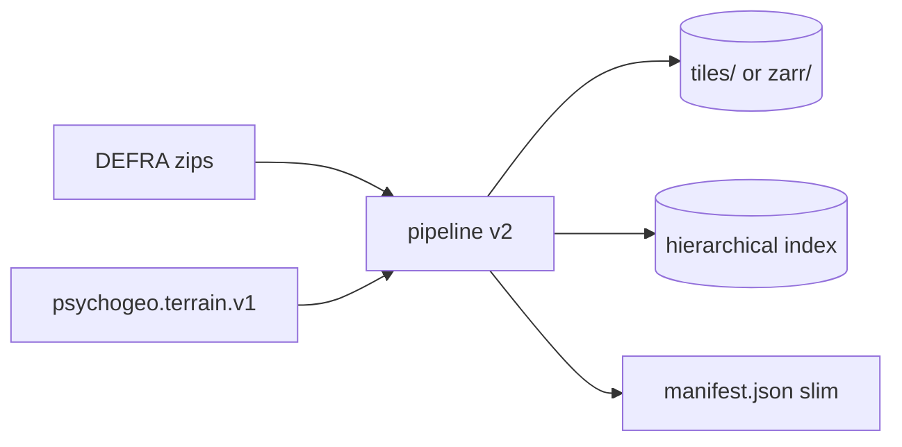

# Storage format and pipeline v2

Planning for ingest that can run on **fresh DEFRA zips** or **existing TerraCognita v1 outputs**, produces a **zarr-image-like level pyramid** without committing to full Zarr yet, and stays honest about **GIS ecosystem** options. From [NOTES.md](../../NOTES.md): bespoke levels, zarr/spatialdata experiment, redundant multi-GB index, overlap/seams.

## Related docs

- [terrain-catalog-and-lod.md](terrain-catalog-and-lod.md) — what the runtime queries from the index.
- [dataset-operations.md](dataset-operations.md) — promote dataset, run jobs.
- [sqlite-catalog.md](sqlite-catalog.md) — optional `index.db` instead of JSON shards at scale.
- [docs/server-side.md](../server-side.md) § _Storage format evolution (Zarr evaluation)_ — codec, apron, zarrita checklist.
- [docs/tile-layers.md](../tile-layers.md) § _Basemap morph_ — apron / overlap requirements.

## Current pipeline (v1 seed)

[scripts/pipelines/defra-terrain/](../../scripts/pipelines/defra-terrain/):

| Stage | Role |
|-------|------|
| `scan.ts` | Discover DEFRA zips on disk |
| `ingest.ts` | Crop, encode HTJ2K, write tiles + shards + manifest |
| `manifest.ts` | `psychogeo.terrain.v1`, shards `index/{east}_{north}.json`, compat `dsm_catalog.compat.json` |

Outputs are **immutable per run** under a versioned directory; manifest lists all shard hrefs.

Gaps relative to notes:

- No **incremental** ingest from prior dataset (re-encode everything).
- Index JSON **duplicates** metadata per tile (size explosion).
- No **multiscale** payloads (single resolution href per channel).
- **Apron** fields exist in types (`apronMetres`) but seam/overlap strategy for national basemap is still open ([tile-layers.md](../tile-layers.md)).

## Pipeline v2 principles

1. **Idempotent tile identity** — `tileId` stable from OSGB nominal origin + channel id + dataset generation; re-ingest updates only changed tiles.
2. **Dual input mode**
   - `source=defra-zips` — current scan path.
   - `source=psychogeo-v1` — read existing manifest + payloads; transcode, re-index, or add channels without re-downloading DEFRA.
3. **Separation of concerns**
   - **Payload store** — segment files, per-tile files, or zarr arrays (HTJ2K blobs). See [§ Contiguous segment files](#contiguous-segment-files-range-requests) for packing many tiles into fewer objects.
   - **Index** — hierarchical, small nodes ([terrain-catalog-and-lod.md](terrain-catalog-and-lod.md)).
   - **Provenance** — optional `provenance.jsonl` or per-tile sidecar, not inlined in every index row.
4. **Progress + validation** — unchanged intent from [server-side.md](../server-side.md): JSON-lines progress, schema validate before promote.



## Zarr-image-like levels (bespoke first)

**Implemented:** bounded cell ingest writes `psychogeo.terrain.v2` / `tc-dsm-pyramid` datasets. See **[v2-pyramid-pipeline.md](v2-pyramid-pipeline.md)** for the authoritative format spec (on-disk layout, schema, derivation contract, CLI, pyramid presets).

Summary:

- Root `metadata.json` + nested `pyramid/{cell}/…/manifest.json` per OSGB node.
- Columnar `leaf.enc` at 5 km nodes; merged `{level}/{gridRef}.j2c` at branch tiers.
- Paths and bounds derived from grid refs ([derive.ts](../../scripts/pipelines/defra-terrain/v2/derive.ts)); zod-validated ([schema.ts](../../scripts/pipelines/defra-terrain/v2/schema.ts)).

The layout below was an **early sketch** (channel-centric dirs). The implemented tree is **spatial-node-centric** under `pyramid/`:

```
dataset/
  metadata.json
  pyramid/
    SP51/
      manifest.json
      2/SP51.j2c
      SP51ne/
        manifest.json
        0/{east}_{north}.j2c
        1/SP51ne.j2c
```

Future Zarr export would map `tileMatrixSet.levels[]` to OME-Zarr multiscale `datasets[]`:

| Concept | Bespoke v2 | OME-Zarr equivalent |
|---------|------------|---------------------|
| Level array | `L{k}/*.j2c` | multiscale `datasets[]` |
| Tile extent | manifest per file + index | `.zattrs` + coordinate_transforms |
| Codec | HTJ2K file per tile | custom v3 codec or pre-decode |
| Apron | baked margin in filename metadata | overlapping chunks problem ([server-side.md](../server-side.md) § 6.1) |

**Overlap / seams** ([NOTES.md](../../NOTES.md), [tile-layers.md](../tile-layers.md)): ingest should bake `apronMetres` into extent and encoding window so adjacent tiles can blend in shader; pipeline records `nominalExtent` vs `extent` separately (types already distinguish these).

## Contiguous segment files (range requests)

v1 writes **one `.j2c` file per nominal tile × channel** ([ingest.ts](../../scripts/pipelines/defra-terrain/ingest.ts) `writeEncodedChannel`). At national scale that implies hundreds of thousands of files. On exFAT/USB volumes this is especially costly (1 MB allocation units, macOS `._` sidecars per file, slow directory walks). The same file-count tax applies on APFS when serving from static hosting or S3 — many small objects dominate metadata and HTTP round-trips even when logical payload size is modest.

**Alternative:** pack **contiguous** runs of encoded tiles into **segment files**; the index stores `(segmentHref, byteOffset, byteLength)` per tile (and channel / pyramid level) instead of a unique path per blob.

### Layout (illustrative)

```
dataset/
  segments/
    height.dsm.fz/
      L5/
        465000_480000.seg    # many 1 km tiles from one 5 km ingest group, concatenated
  index/
    …                      # leaf rows point into segments
```

Each segment is an opaque byte stream of back-to-back HTJ2K codestreams (order defined at ingest, recorded in index or a small `.seg.json` sidecar manifest).

### Runtime fetch

Browser (or proxy) issues a normal `GET` with **`Range: bytes=offset-(offset+length-1)`** on `segmentHref`. The WASM decoder receives exactly one tile’s bytes — same as today’s full-file fetch, no change to OpenJPH input.

Requirements:

| Layer | Responsibility |
|-------|----------------|
| **Static host / CDN / S3** | Honour `Range` (standard for S3, nginx, most CDNs). |
| **Dev proxy** ([start-server.js](../../src/start-server.js)) | Forward `Range` on terrain dataset routes (or map segment URL → `fs.createReadStream` with `{ start, end }`). |
| **Catalog / channel record** | Expose `segmentHref`, `offset`, `length` (and encoding scalars) instead of per-tile `href`. |
| **`RasterChannel.load`** | `fetch(url, { headers: { Range: … } })` → `arrayBuffer` → existing decode path. |

This aligns with [server-side.md](../server-side.md) § 6.4 (Zarr shard = fewer files + range reads) and [terrain-catalog-and-lod.md](terrain-catalog-and-lod.md) § 2 (index holds pointers, not fat blobs).

### Packaging strategies (open choice)

| Strategy | Segment boundary | Fits |
|----------|------------------|------|
| **DEFRA group** | One segment per 5 km source tile × channel × level | Matches ingest batch ([scan.ts](../../scripts/pipelines/defra-terrain/scan.ts)); easy append on resume |
| **Quadtree leaf** | One segment per catalog leaf node extent | Matches hierarchical index descent |
| **Spatial strip** | Fixed easting column or row of 1 km cells | Sequential read patterns for cluster ingest |

Tiles need not be byte-aligned to compression boundaries across segment interior — each record’s `length` is the exact encoded size. Optional **padding** between blobs (e.g. 4-byte align) simplifies mmap tooling at the cost of a few bytes per tile.

### Operations

| Operation | Behaviour |
|-----------|-----------|
| `ingest-full` / append | Write or extend segments; emit offset table |
| `reindex` | Rebuild index from existing per-tile `.j2c` **or** existing segments without re-encode |
| `source=psychogeo-v1` | **Pack** pass: concatenate v1 `tiles/**/*.j2c` into segments + new index (no DEFRA re-read) |
| Partial tile update | Rewrite one segment, or append new generation segment and supersede index rows |

Immutable segments per dataset generation keep CDN caching simple (`segmentHref` includes content hash or generation id).

### Tradeoffs

| Pros | Cons |
|------|------|
| Orders of magnitude fewer files | Replacing one tile may require rewriting a whole segment unless overlay segments are allowed |
| Better sequential I/O on cluster scratch disks | **One `Range` per tile/channel by default** — same RT count as separate files unless layout batches (see [§ Reducing HTTP round-trips](#reducing-http-round-trips)) |
| Works on static/S3 without a database | Proxy must implement Range correctly in dev |
| Natural companion to slim index + SQLite ([sqlite-catalog.md](sqlite-catalog.md)) | Tooling (`ls`, `find`, manual inspection) less granular than per-tile paths |

Not a substitute for **slimmer index JSON** or **multiscale `L*` pyramids** — it addresses **payload file count and filesystem overhead** only.

### Sequencing note

Can land **after** slim shard schema and **`source=psychogeo-v1` reindex**, as a `pack-segments` transform on existing v1 `tiles/` (validates offset index + Range fetch before changing ingest emit). National re-ingest on cluster/APFS can emit segments directly once the index schema stabilises.

## Reducing HTTP round-trips

Today ([terrainDatasetCatalog.ts](../../src/geo/terrainDatasetCatalog.ts)) startup does **`fetch(manifest)` + `Promise.all` over every shard** — thousands of index GETs before any height decode. Per visible 1 km leaf, v1 can add **one GET per channel** (FZ, LZ, DZ, DTM, base). Segments + single `Range` per blob **do not** reduce round-trips unless the **packing layout and loader** deliberately batch bytes. Worth pursuing in this order:

### Tier 1 — high leverage (catalog / scene graph)

| Approach | Effect | Notes |
|----------|--------|-------|
| **Viewport index query** | Replaces “download all shards” with 1–few requests | SQLite `index.db` + `GET /terrain-datasets/.../tiles-in-bounds?…` ([sqlite-catalog.md](sqlite-catalog.md)), or descend a quadtree and fetch only intersecting branch/leaf JSON ([terrain-catalog-and-lod.md](terrain-catalog-and-lod.md)). Biggest win for startup and panning. |
| **Merged branch overviews (catalog C)** | Zoomed out: **1 coarse HTJ2K** per branch instead of N leaf GETs | Matches raster pyramid + sparse scene graph; fixes RT and VRAM when the frustum covers many km². |
| **Lazy catalog / no full `Record` at boot** | Zero index RT until first frame needs bounds | Pair with TileTree; manifest root may be the only initial fetch. |

### Tier 2 — segment layout + fetch (payload)

Design segments so one request amortises multiple tiles or channels:

| Layout | Request pattern | Tradeoff |
|--------|-----------------|----------|
| **All channels for one 1 km tile contiguous** | One `Range` (or full small object) → slice offsets for FZ/LZ/DZ decode | Slightly larger read if only one channel needed; usually all height channels load together anyway. |
| **Wide `Range` over adjacent 1 km cells** | One GET covers easting strip inside a 5 km segment; loader splits by offset table | Extra bytes if viewport is one tile at corner of strip; good for pan along a row. |
| **Whole segment for dev / warm patch** | Single GET when prefetching a 5 km group (cluster → browser sideload) | Simple; not for national view. |

**Not recommended as primary:** HTTP multipart **multiple ranges** in one request (`Range: bytes=0-99,200-299`) — CDN and `fetch` behaviour is inconsistent; prefer one contiguous span.

### Tier 3 — optional server / transport

| Approach | Effect | Notes |
|----------|--------|-------|
| **`POST /tiles/batch`** (dev proxy or API) | 1 RT returns length-prefixed or multipart bundle of N codestreams | Easiest to prototype; not CDN-static without a worker. Good for uni cluster → browser experiments. |
| **HTTP/2 / HTTP/3 static host** | Many parallel tile GETs share one connection | Cuts TLS/TCP overhead, not request count; still helps on CDN. |
| **Precompressed index slice** | One `.cbor` / `.br` blob per viewport from edge function | Alternative to SQLite API for static-only hosting. |

### Tier 4 — repeat visits and mobile offline

| Approach | Effect | Notes |
|----------|--------|-------|
| **Service worker + local byte store** | App shell offline; **prefetched** terrain packs in low signal | Deliberate “download region” UX, not opportunistic cache — see [future-terrain.md](../future-terrain.md) § _Offline and low signal_. Pairs with segment packs and bounds index query. |
| **Early Hints** on manifest | Slightly faster first paint | Marginal |
| **Larger object part sizes (S3)** | Throughput for big segment uploads | Hosting ops |

### What to implement first

1. **Stop fetching all shards** (spatial query or tree descent) — aligns with catalog Phase 1–2.
2. **Branch coarse payloads** when zoomed out — fewer payload RTs and less decode work.
3. **`pack-segments` with per-tile channel run** — one `Range` per nominal tile for all height channels.
4. **Batch endpoint** only if static Range batching is insufficient for a hosted demo.

Success metric: at a fixed zoom, **payload GET count ≈ visible raster nodes × (1 + optional prefetch margin)**, not catalog tile count × channels.

## Zarr and GIS ecosystem (evaluation track)

Not blocking v2 bespoke layout. Run when national extent stabilises ([NOTES.md](../../NOTES.md) FOI / full extent).

| Option | Fit | Friction |
|--------|-----|----------|
| **OME-Zarr + custom HTJ2K codec** | Aligns with multiscale + zarrita in browser | Codec adapter work ([server-side.md](../server-side.md) § 6.2) |
| **COG / GeoZarr / rioxarray stack** | Strong GIS tooling | HTJ2K not standard; may duplicate compression experiment |
| **spatialdata** | Rich annotations | Microscopy-oriented; poor fit for OSGB DSM ([NOTES.md](../../NOTES.md)) |
| **FlatGeobuf / PMTiles** | Great for vectors / raster pyramids in maps | Height field + custom shaders still bespoke |

Recommendation: **prototype zarrita + one small multiscale group** transcoded from v2 `L0..Ln` layout; keep v2 files as source of truth until browser path proves parity with `jp2Texture`.

Checklist inherited from [server-side.md](../server-side.md) § 6 — apron strategy, shard size vs viewport, `.zattrs` vs compat catalog, compression experiment continuity.

## Index slimming (concrete)

| Remove from per-tile index row | Keep elsewhere |
|--------------------------------|----------------|
| Repeated dataset `crs` / licence | manifest root |
| Full `provenance[]` per tile | `provenance.jsonl` keyed by `tileId` |
| Duplicate quality metrics per channel | ingest QA report per shard |
| `extent` if equals `nominalExtent` + apron rule | derive in loader |

Target: leaf shard JSON **orders of magnitude** smaller than today for the same tile count.

Compat: continue emitting `dsm_catalog.compat.json` for legacy [TileLoaderUK.ts](../../src/geo/TileLoaderUK.ts) until Phase 1 catalog API lands ([terrain-catalog-and-lod.md](terrain-catalog-and-lod.md)).

## Incremental operations

Operator-machine datasets and copy/re-point migration are described in [dataset-operations.md](dataset-operations.md) § _Low-friction data migration_.

| Operation | Input | Output |
|-----------|-------|--------|
| `ingest-full` | DEFRA dir | new dataset version |
| `ingest-append` | DEFRA dir + prior manifest | new tiles only |
| `reindex` | existing payloads | new index tree or `index.db`, same blobs |
| `pack-segments` | per-tile `.j2c` or v1 `tiles/` | `segments/` + offset index ([§ Contiguous segment files](#contiguous-segment-files-range-requests)) |
| `index-to-sqlite` | v1 JSON shards | `index.db` beside `tiles/` ([sqlite-catalog.md](sqlite-catalog.md)) |
| `add-channel` | e.g. `height.aux.dz` | new channel dir + index pointers |
| `export-compat` | v2 manifest | `dsm_catalog.compat.json` |

## Sequencing with other work

1. ~~**Multiscale pyramid + hierarchical index (bounded cell)**~~ — **done** for `--cell` ingest; see [v2-pyramid-pipeline.md](v2-pyramid-pipeline.md).
2. **Frontend v2 catalog** — lazy manifest descent + pyramid level selection ([terrain-catalog-and-lod.md](terrain-catalog-and-lod.md#frontend-rendering-v2-datasets)).
3. **Slim v1 shard schema** — quick win on disk size for existing datasets; no flag day.
4. **`source=psychogeo-v1`** mode — reindex national data without re-downloading DEFRA.
5. **National multi-cell ingest** — extend tree to 100 km tier; same manifest contract.
6. **`pack-segments` + Range fetch** — concatenate payloads; wire proxy and channel loader.
7. **Zarr export** — optional publish step from v2 layout for CDN/static hosting.

## Open questions

- Segment packing unit: DEFRA 5 km group vs quadtree leaf vs strip — affects resume and partial updates.
- Tile size in metres: keep 1 km shards vs align to DEFRA tile refs (`SU44ne` etc.)?
- uint16-normalized vs int16-delta default for national DSM — artefact tradeoffs with contour shader?
- Store LZ/FZ/DZ as separate channels vs generation picks one primary — affects manifest `channels[]` and UI toggles.

## Success criteria

- Re-run ingest after FOI delivery without re-encoding unchanged tiles.
- Index size scales ~linearly with tile count with small constant factor, not multi-GB for national coverage.
- Same runtime can load v1 compat, v2 bespoke levels, and (later) Zarr export of the same dataset id.
