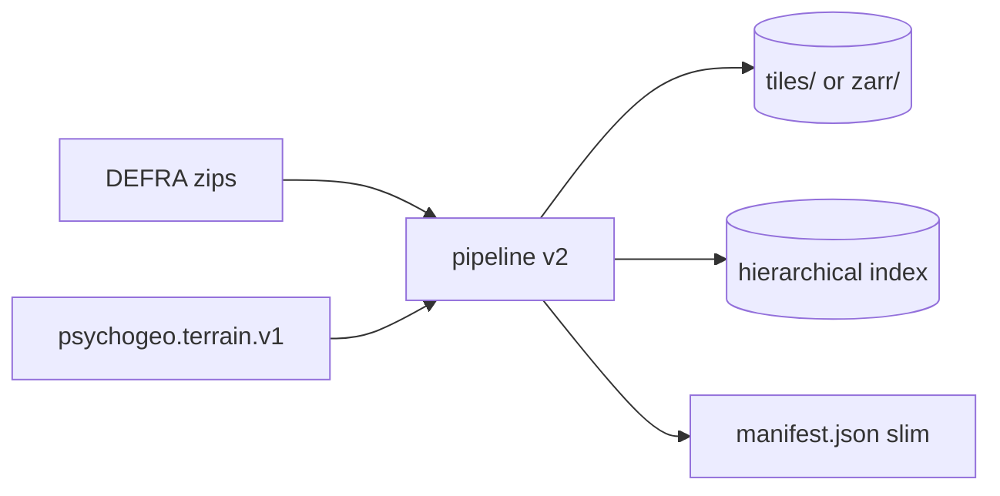

# Storage format and pipeline v2

Planning for ingest that can run on **fresh DEFRA zips** or **existing TerraCognita v1 outputs**, produces a **zarr-image-like level pyramid** without committing to full Zarr yet, and stays honest about **GIS ecosystem** options. From [NOTES.md](../../NOTES.md): bespoke levels, zarr/spatialdata experiment, redundant multi-GB index, overlap/seams.

## Related docs

- [terrain-catalog-and-lod.md](terrain-catalog-and-lod.md) — what the runtime queries from the index.
- [dataset-operations.md](dataset-operations.md) — promote dataset, run jobs.
- [sqlite-catalog.md](sqlite-catalog.md) — optional `index.db` instead of JSON shards at scale.
- [docs/server-side.md](../server-side.md) § _Storage format evolution (Zarr evaluation)_ — codec, apron, zarrita checklist.
- [docs/tile-layers.md](../tile-layers.md) § _Basemap morph_ — apron / overlap requirements.

## Current pipeline (v1 seed)

[scripts/pipelines/defra-terrain/](../../scripts/pipelines/defra-terrain/):

| Stage | Role |
|-------|------|
| `scan.ts` | Discover DEFRA zips on disk |
| `ingest.ts` | Crop, encode HTJ2K, write tiles + shards + manifest |
| `manifest.ts` | `psychogeo.terrain.v1`, shards `index/{east}_{north}.json`, compat `dsm_catalog.compat.json` |

Outputs are **immutable per run** under a versioned directory; manifest lists all shard hrefs.

Gaps relative to notes:

- No **incremental** ingest from prior dataset (re-encode everything).
- Index JSON **duplicates** metadata per tile (size explosion).
- No **multiscale** payloads (single resolution href per channel).
- **Apron** fields exist in types (`apronMetres`) but seam/overlap strategy for national basemap is still open ([tile-layers.md](../tile-layers.md)).

## Pipeline v2 principles

1. **Idempotent tile identity** — `tileId` stable from OSGB nominal origin + channel id + dataset generation; re-ingest updates only changed tiles.
2. **Dual input mode**
   - `source=defra-zips` — current scan path.
   - `source=psychogeo-v1` — read existing manifest + payloads; transcode, re-index, or add channels without re-downloading DEFRA.
3. **Separation of concerns**
   - **Payload store** — files or zarr arrays (HTJ2K blobs).
   - **Index** — hierarchical, small nodes ([terrain-catalog-and-lod.md](terrain-catalog-and-lod.md)).
   - **Provenance** — optional `provenance.jsonl` or per-tile sidecar, not inlined in every index row.
4. **Progress + validation** — unchanged intent from [server-side.md](../server-side.md): JSON-lines progress, schema validate before promote.



## Zarr-image-like levels (bespoke first)

Before adopting Zarr, define an internal layout that **could** map to OME-Zarr multiscale later:

```
dataset/
  manifest.json          # psychogeo.terrain.v2 — bounds, channels, index root
  index/
    root.json              # quadtree root
    ...
  channels/
    height.dsm.fz/
      L0/                  # coarsest (overview)
      L1/
      ...
      L{n}/                # full 1 m (or native) resolution
        {tileId}.j2c
```

| Concept | Bespoke v2 | OME-Zarr equivalent |
|---------|------------|---------------------|
| Level array | `L{k}/*.j2c` | multiscale `datasets[]` |
| Tile extent | manifest per file + index | `.zattrs` + coordinate_transforms |
| Codec | HTJ2K file per tile | custom v3 codec or pre-decode |
| Apron | baked margin in filename metadata | overlapping chunks problem ([server-side.md](../server-side.md) § 6.1) |

**Overlap / seams** ([NOTES.md](../../NOTES.md), [tile-layers.md](../tile-layers.md)): ingest should bake `apronMetres` into extent and encoding window so adjacent tiles can blend in shader; pipeline records `nominalExtent` vs `extent` separately (types already distinguish these).

## Zarr and GIS ecosystem (evaluation track)

Not blocking v2 bespoke layout. Run when national extent stabilises ([NOTES.md](../../NOTES.md) FOI / full extent).

| Option | Fit | Friction |
|--------|-----|----------|
| **OME-Zarr + custom HTJ2K codec** | Aligns with multiscale + zarrita in browser | Codec adapter work ([server-side.md](../server-side.md) § 6.2) |
| **COG / GeoZarr / rioxarray stack** | Strong GIS tooling | HTJ2K not standard; may duplicate compression experiment |
| **spatialdata** | Rich annotations | Microscopy-oriented; poor fit for OSGB DSM ([NOTES.md](../../NOTES.md)) |
| **FlatGeobuf / PMTiles** | Great for vectors / raster pyramids in maps | Height field + custom shaders still bespoke |

Recommendation: **prototype zarrita + one small multiscale group** transcoded from v2 `L0..Ln` layout; keep v2 files as source of truth until browser path proves parity with `jp2Texture`.

Checklist inherited from [server-side.md](../server-side.md) § 6 — apron strategy, shard size vs viewport, `.zattrs` vs compat catalog, compression experiment continuity.

## Index slimming (concrete)

| Remove from per-tile index row | Keep elsewhere |
|--------------------------------|----------------|
| Repeated dataset `crs` / licence | manifest root |
| Full `provenance[]` per tile | `provenance.jsonl` keyed by `tileId` |
| Duplicate quality metrics per channel | ingest QA report per shard |
| `extent` if equals `nominalExtent` + apron rule | derive in loader |

Target: leaf shard JSON **orders of magnitude** smaller than today for the same tile count.

Compat: continue emitting `dsm_catalog.compat.json` for legacy [TileLoaderUK.ts](../../src/geo/TileLoaderUK.ts) until Phase 1 catalog API lands ([terrain-catalog-and-lod.md](terrain-catalog-and-lod.md)).

## Incremental operations

Operator-machine datasets and copy/re-point migration are described in [dataset-operations.md](dataset-operations.md) § _Low-friction data migration_.

| Operation | Input | Output |
|-----------|-------|--------|
| `ingest-full` | DEFRA dir | new dataset version |
| `ingest-append` | DEFRA dir + prior manifest | new tiles only |
| `reindex` | existing payloads | new index tree or `index.db`, same blobs |
| `index-to-sqlite` | v1 JSON shards | `index.db` beside `tiles/` ([sqlite-catalog.md](sqlite-catalog.md)) |
| `add-channel` | e.g. `height.aux.dz` | new channel dir + index pointers |
| `export-compat` | v2 manifest | `dsm_catalog.compat.json` |

## Sequencing with other work

1. **Slim shard schema** in v1 generator (quick win on disk size) — no v2 flag day.
2. **`source=psychogeo-v1`** mode — reindex national data without re-downloading DEFRA.
3. **Multiscale `L*` directories** — raster pyramid hrefs in index; scene graph binds tree depth to pyramid level ([terrain-catalog-and-lod.md](terrain-catalog-and-lod.md) §3 — distinct from `GeoLOD` mesh densities).
4. **Hierarchical index emitter** or **`index.db`** — pair with [terrain-catalog-and-lod.md](terrain-catalog-and-lod.md) Phase 5; compare JSON quadtree vs SQLite in [sqlite-catalog.md](sqlite-catalog.md) before committing.
5. **Zarr export** — optional publish step from v2 layout for CDN/static hosting ([NOTES.md](../../NOTES.md) hosting).

## Open questions

- Tile size in metres: keep 1 km shards vs align to DEFRA tile refs (`SU44ne` etc.)?
- uint16-normalized vs int16-delta default for national DSM — artefact tradeoffs with contour shader?
- Store LZ/FZ/DZ as separate channels vs generation picks one primary — affects manifest `channels[]` and UI toggles.

## Success criteria

- Re-run ingest after FOI delivery without re-encoding unchanged tiles.
- Index size scales ~linearly with tile count with small constant factor, not multi-GB for national coverage.
- Same runtime can load v1 compat, v2 bespoke levels, and (later) Zarr export of the same dataset id.
