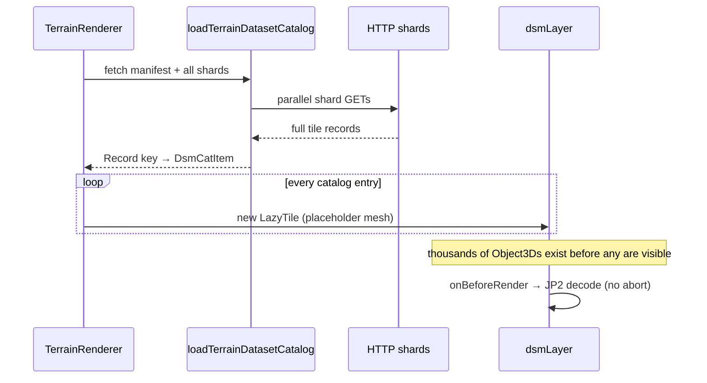
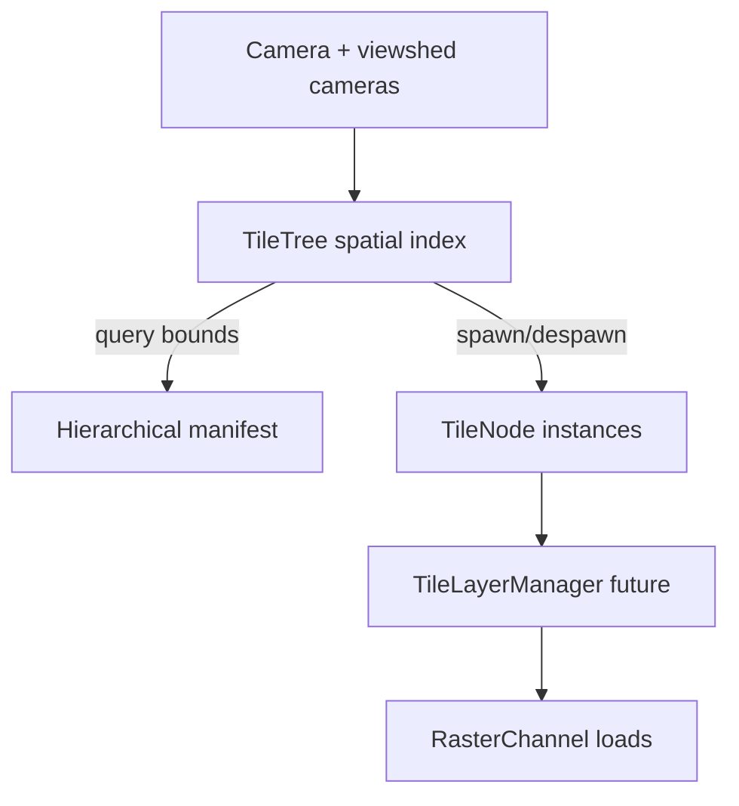
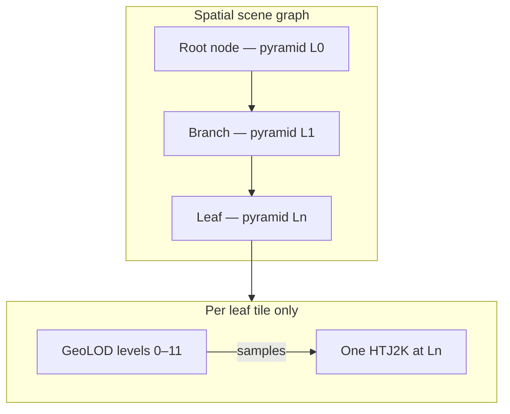

# Terrain catalog scale and LOD graph

Addressing [NOTES.md](../../NOTES.md): full manifest load, scene with all known nodes, VRAM thrashing when zoomed out, need to abort non-visible loads and evict under pressure. Complements [docs/tile-layers.md](../tile-layers.md) (runtime channel API) with **catalog and scene-graph** design.

## Related docs

- [docs/tile-layers.md](../tile-layers.md) § _Visibility model_ — frustum transitions, working-set budget (runtime enforcement).
- [storage-and-pipeline-v2.md](storage-and-pipeline-v2.md) — slimmer hierarchical index on disk.
- [dataset-operations.md](dataset-operations.md) — which manifest URL is active.
- [sqlite-catalog.md](sqlite-catalog.md) — per-dataset `index.db` + bounds queries as an alternative to JSON shard trees.

## Current behaviour (problem)



Evidence in code:

- [src/geo/terrainDatasetCatalog.ts](../../src/geo/terrainDatasetCatalog.ts) — `Promise.all` over **all** `manifest.index.shards`; builds complete `catalog` object.
- [src/geo/TileLoaderUK.ts](../../src/geo/TileLoaderUK.ts) `makeTiles` — `Object.entries(catalog).forEach` → `this.tiles.push(new LazyTile(...))` for **every** tile.
- [src/geo/TileLoaderUK.ts](../../src/geo/TileLoaderUK.ts) `LazyTile` — load starts on first `onBeforeRender`; no `AbortSignal`, no unload when off-screen.
- [src/geo/LodUtils.ts](../../src/geo/LodUtils.ts) — `GeoLOD` picks among 12 **geometric** resolutions per tile, but does not reduce **how many tiles** exist in the scene; `sources[2000|1000|500]` in catalog items is not populated from v1 shards (only `'1000'` today).

At national scale this implies:

- Large startup memory (full catalog map + N placeholders).
- Zoomed-out camera still intersects many placeholders → many overlapping JP2 decodes and GPU textures.
- Multi-GB `index/` download even if the viewport needs a handful of shards ([NOTES.md](../../NOTES.md)).

## Target: two-level spatial structure

Separate **metadata tree** (what exists, where, at what resolution) from **scene nodes** (what is instantiated and what channels are loaded).

### 1. Hierarchical catalog index (on disk / over network)

Evolve `psychogeo.terrain.v1` index from flat shard list + fat per-tile records toward a **pyramid / quadtree** over OSGB space:

| Level | Node carries | Child linkage |
|-------|----------------|---------------|
| Root | dataset bounds, channel summary, child href | 4 (or N) quadrant children |
| Branch | aggregated bounds, tile count, max resolution | children or leaf shard href |
| Leaf shard | minimal tile table **or** pointer into columnar sidecar | — |

Per-tile records at leaf should hold only:

- `tileId`, `nominalExtent`, channel hrefs + encoding scalars (min/max/scale).
- **Not** duplicated dataset-level prose, full provenance arrays, or per-channel quality stats on every row (those belong in dataset manifest or a provenance sidecar keyed by `tileId`).

Redundancy today: each `TileRecord` in a shard repeats extent, encoding metadata, and provenance suitable for dataset-level documentation — contributing to multi-GB `index/` ([NOTES.md](../../NOTES.md)).

**Query API** (browser or thin server):

```
getIndexNode(manifest, east, north, depth?) → { children?, tiles?, channels? }
```

Viewport-driven: fetch root → descend only into quadrants intersecting frustum (and viewshed shadow frustum — see [future-terrain.md](../future-terrain.md) § _Light-driven LOD_).

**Alternative:** per-dataset **`index.db`** (SQLite + R-tree) with a single bounds query — same viewport driver, fewer HTTP round-trips than a deep JSON tree. Evaluated in [sqlite-catalog.md](sqlite-catalog.md). The frontend query API (`getIndexNode` / `tiles-in-bounds`) should be storage-agnostic so JSON quadtree and SQLite are interchangeable behind the proxy.

### 2. Scene graph: sparse tile nodes

Replace "create all `LazyTile` at startup" with a **TileTree** owned by the terrain renderer:

| State | Scene contents |
|-------|----------------|
| Cold | Empty layer or coarse aggregate node (future basemap / overview channel) |
| Warm | Branch nodes bound to a **coarse raster pyramid level** (overview HTJ2K); simple mesh, no leaf payload |
| Hot | Leaf `TileNode` bound to **fine pyramid level**; `GeoLOD` procedural meshes + channels per [tile-layers.md](../tile-layers.md) |



**Invariants**

- Number of `TileNode` instances ≈ visible tiles × small constant, not catalog cardinality.
- Descending the index tree and spawning nodes are the same visibility decision (shared frustum test).
- Off-screen tile: cancel in-flight channel load (`AbortSignal`); optionally despawn node or strip channels keep geometry shell.

### 3. Geometric LOD vs raster pyramid (keep separate)

Two independent knobs — do not map `GeoLOD` level 1:1 to catalog pyramid level.

#### Geometric LOD (rendering, ~unchanged)

[`GeoLOD`](../../src/geo/LodUtils.ts) keeps the current character: **~12 procedural mesh densities** per active tile node — subsampled triangle grids from the same 4096² topology, chosen by camera distance (and viewshed observer) to the tile bounds. This controls **how many vertices sample the bound height texture**, not which HTJ2K file exists on disk.

- Same vertex-displacement / `gl_VertexID` shader model as today.
- A leaf tile at full raster resolution can still drop to mesh level 8 when far away — fewer triangles, **same** decoded texture.
- Near the camera, mesh level rises toward the cap; raster payload does not need to change for that transition.

#### Raster pyramid (data + scene graph)

The **catalog / spatial hierarchy** carries **discrete encoded resolutions** (e.g. 8 m overview, 2 m regional, 1 m leaf), as in [storage-and-pipeline-v2.md](storage-and-pipeline-v2.md) `L0…Ln` or merged overview tiles. **Scene-graph nodes** at different tree depths are associated with different pyramid levels:

| Scene-graph role | Raster | Mesh (procedural) |
|------------------|--------|-------------------|
| Root / branch | Coarse pyramid href (fewer pixels, wider extent) | Fixed coarse grid or limited `GeoLOD` band — enough to displace, not 12 full bands |
| Leaf | Fine pyramid href for nominal 1 m (or DTM 10 m) | Full `GeoLOD` stack as today |

Zoom **out**: ascend the tree (or stop instantiating leaves) → swap to parent node’s coarse raster. Zoom **in**: descend → spawn leaves and attach fine pyramid channel. That is independent of which of the 12 mesh levels `GeoLOD` picks inside a leaf.



#### Channel / catalog shape

Raster pyramid levels appear in the index as explicit keys (not `'1000'` only):

```ts
// Illustrative — channel payload keyed by pyramid, not by GeoLOD level
channels: {
  'height.dsm.fz': {
    pyramid: {
      L0: { href, resolutionMetres: 8, … },
      L2: { href, resolutionMetres: 2, … },
      L5: { href, resolutionMetres: 1, … },
    },
  },
}
```

`RasterChannel.load` receives `TileLoadContext` with **pyramid level** (from tree depth / zoom) and **geometric lodLevel** (from `GeoLOD`) separately. The manager picks href from pyramid; `GeoLOD` only toggles mesh children.

#### Pipeline options (raster side only)

| Approach | Catalog | Scene graph |
|----------|---------|-------------|
| **A. Leaf-only pyramid** | One href per leaf tile (today) | Branches are spatial placeholders only; geometric LOD only savings |
| **B. Per-tile multiscale** | `L0…Ln` hrefs on each leaf record | Branches optional; coarse levels used when leaf not spawned |
| **C. Merged overviews** | Branch nodes own coarse HTJ2K covering many leaves | Strong match to §2 Warm/Hot split; clearest zoom-out path |

Recommendation: **C** (or **B**) at national scale for raster; **keep `GeoLOD` as-is** inside leaves. Winchester can stay on **A** until the tree exists.

Populate `DsmCatItem.sources` (or channel records) with pyramid level keys; do not overload them as geometric LOD indices.

### 4. Load cancellation and memory pressure

Map directly onto [tile-layers.md](../tile-layers.md):

| Today | Target |
|-------|--------|
| `onBeforeRender` one-shot load | `TileLayerManager.observeVisibility` |
| `lossyGeneration` counter in compression experiment | `AbortSignal` per channel load |
| No eviction | Working-set LRU on `RasterPayload.bytes` |
| All tiles in `this.tiles[]` | Tree + optional weak ref to hot nodes |

**Near-term bridge** (before full manager):

1. Frustum poll each frame; maintain `visibleSet: Set<tileId>`.
2. Pass `AbortController` into JP2 load path; abort when tile leaves `visibleSet`.
3. `dispose()` texture when evicted; keep `GeoLOD` mesh if re-entry is likely.

**Side note — dithering** ([NOTES.md](../../NOTES.md)): quantisation banding in contours may be encoder or shader sampling. Track as rendering experiment after load storm is fixed; try ordered dither in height sampling or contour threshold pass; unrelated to catalog shape but easier to evaluate when fewer tiles load at once.

## Phased delivery

### Phase 1 — Shard-scoped catalog load

- Extend manifest with optional `spatialIndex` root href (or keep flat shards but add bbox per shard in manifest — already have `extent` on `TileIndexShard`).
- Change `loadTerrainDatasetCatalog` to **lazy API**: `loadShardsInBounds(bounds)` instead of merging all shards.
- `makeTiles`: only instantiate `LazyTile` for tiles in initial bounds + margin; expand on camera move (debounced).

Acceptance: national manifest present on disk; app only fetches shards intersecting viewport.

### Phase 2 — Sparse scene graph

- Introduce `TileTree` in [TileLoaderUK.ts](../../src/geo/TileLoaderUK.ts); migrate `this.tiles` to tree iteration for debug counts.
- Remove eager `forEach` over full catalog.

Acceptance: object count in scene proportional to visible area, not England.

### Phase 3 — Abort + eviction bridge

- Wire abort into [jp2kloader.ts](../../src/openjpegjs/jp2kloader.ts) / `getTileMesh`.
- Soft GPU byte cap; evict oldest non-basemap textures.

Acceptance: zoom out cancels in-flight decodes; memory stable when panning across large extent.

### Phase 4 — TileLayerManager

- Full migration per [tile-layers.md](../tile-layers.md) § _Migration map_; `height.primary` channel owns load/dispose.

Acceptance: compression experiment uses channels; no module singleton; second renderer possible.

### Phase 5 — Hierarchical index on disk

- Pipeline emits quadtree index + slim leaf shards ([storage-and-pipeline-v2.md](storage-and-pipeline-v2.md)).
- Deprecate full-shard download path.

## Metrics to track

| Metric | How |
|--------|-----|
| Shards fetched per session | network log |
| `LazyTile` / `TileNode` count | debug panel |
| In-flight JP2 decodes | counter |
| GPU bytes (textures) | sum `RasterPayload.bytes` |
| Time-to-first-frame after pan | stopwatch / perf mark |

## Open questions

- Shard size today (`shardSizeMetres` in manifest) vs optimal for HTTP — trade fewer large JSONs vs more parallel small ones?
- Should invisible tiles keep placeholder meshes for picking / track overlay alignment?
- Viewshed-driven prefetch: how many tiles beyond frustum to speculatively warm?

## Success criteria

- National dataset: startup does not download multi-GB index or create 10⁴+ scene nodes.
- Zoomed-out view: GPU memory and decode concurrency bounded; panning does not accumulate textures indefinitely.
- Zoomed in: leaf tiles use fine raster pyramid + high geometric `GeoLOD` where needed; zoomed out: coarse pyramid on branch nodes without decoding every leaf HTJ2K.
