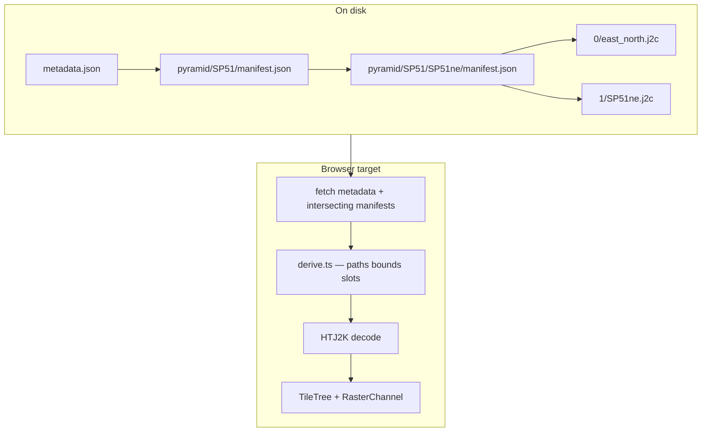

# V2 pyramid pipeline (`tc-dsm-pyramid`)

Implemented bounded-cell ingest for `psychogeo.terrain.v2` datasets. This doc is the **authoritative reference** for the on-disk format, derivation contract, CLI, and how the browser should consume it. Broader pipeline roadmap (v1 reindex, segments, Zarr) remains in [storage-and-pipeline-v2.md](storage-and-pipeline-v2.md).

## Related docs

- [terrain-catalog-and-lod.md](terrain-catalog-and-lod.md) — sparse scene graph, geometric LOD vs raster pyramid, **frontend integration phases**.
- [tile-layers.md](../tile-layers.md) — target in-browser channel lifecycle (`RasterChannel`, `TileLayerManager`).
- [storage-and-pipeline-v2.md](storage-and-pipeline-v2.md) — longer-term ops (segments, SQLite, Zarr, v1 reindex).

## Design rationale

### Problem

v1 stores a flat list of index shards with fat per-tile JSON. At national scale the index alone is multi-GB, and the runtime currently fetches **every shard** at startup ([terrainDatasetCatalog.ts](../../src/geo/terrainDatasetCatalog.ts)). Each tile record repeats bounds, URLs, and provenance that can be derived or moved to dataset level.

### Approach

1. **OSGB spatial hierarchy as the index tree** — 10 km cell → 5 km DEFRA quadrants → 1 km leaf slots. Manifests exist only where data was ingested.
2. **Derivation over duplication** — root `metadata.json` formalises naming templates and pyramid levels; per-node manifests store **encoding scalars only**. Bounds, URLs, and pixel dimensions are computed ([derive.ts](../../scripts/pipelines/defra-terrain/v2/derive.ts)).
3. **Columnar leaf encoding** — each 5 km node holds parallel `enc.min[]`, `enc.max[]`, … arrays (25 slots) plus optional `missing[]` for sparse coverage.
4. **Merged raster pyramid** — branch nodes own coarse HTJ2K overviews (8 m @ 5 km, 32 m @ 10 km by default). Zoomed-out rendering fetches one coarse chunk instead of hundreds of leaf `.j2c` files.
5. **Zod validation** — schema contract in [schema.ts](../../scripts/pipelines/defra-terrain/v2/schema.ts); invalid manifests fail on pipeline write and reader load.



## On-disk layout

```
dataset/
  metadata.json                      # psychogeo.terrain.v2, tileMatrixSet, naming, indexRoot
  index/
    completed-groups.json            # resume checkpoint (year:tileRef)
  pyramid/
    SP51/                            # ingest cell (10 km)
      manifest.json                  # children[], levels.2 encoding
      2/
        SP51.j2c                     # 32 m merged overview
      SP51ne/                        # 5 km quadrant
        manifest.json                # levels.1 + leaf.enc
        0/
          455000_215000.j2c          # 1 m leaf (1 km nominal)
          …
        1/
          SP51ne.j2c                 # 8 m merged overview
      SP51nw/ …
```

Paths nest under `pyramid/{ingestCell}/` for bounded cell ingests. National ingest would extend the tree upward (100 km → 10 km → …) using the same manifest shape.

## Schema contract

### Root `metadata.json`

| Field | Purpose |
|-------|---------|
| `schemaVersion` | `"psychogeo.terrain.v2"` |
| `format` | `"tc-dsm-pyramid"` — layout discriminator |
| `ingestCell` | 10 km OSGB ref root for this dataset slice (e.g. `SP51`) |
| `channelId` | Primary channel (default `height.dsm.fz`) |
| `spatialIndex.tiers[]` | OSGB tier sizes (100 km … 1 km) |
| `naming` | Path templates — no per-chunk URLs in manifests |
| `tileMatrixSet.levels[]` | Configurable pyramid: `level`, `resolutionMetres`, `tierMetres` |
| `encoding` | HTJ2K + `perChunkScaleOffset` defaults |
| `indexRoot` | Href to cell root manifest (e.g. `pyramid/SP51/manifest.json`) |
| `skippedGroups` | Optional — 5 km groups not ingested, with `{ tileRef, year, reason }` |

Validated by `terrainManifestV2Schema` in [schema.ts](../../scripts/pipelines/defra-terrain/v2/schema.ts).

### Per-node `manifest.json`

| Field | When present |
|-------|--------------|
| `gridRef` | Always |
| `children` | Branch nodes — bare `string[]` of child grid refs (sparse: only ingested quadrants) |
| `coverage` | `"partial"` \| `"complete"` on cell root when fewer than four 5 km groups |
| `levels.{n}` | Merged overview at pyramid level *n* — `{ min, max, scale, offset }` only |
| `leaf` | 5 km nodes — columnar `enc` + optional `missing` |

A node at spatial tier M carries `levels.{n}` iff `tileMatrixSet.levels[n].tierMetres === M`. Level 0 is special: finest payloads live in `leaf.enc` (1 km slots), not as `{gridRef}.j2c` at level 0 on the 5 km node.

### Sparse regions

- **Branch:** `children` lists only grid refs with manifests on disk.
- **Leaf:** `leaf.missing: [7, 19]` — indices into the 5×5 row-major grid; reader skips before fetch/decode. Arrays stay length 25; absent slots are never read.
- **National:** no manifest files for cells without data.

## Derivation contract

Shared logic in [derive.ts](../../scripts/pipelines/defra-terrain/v2/derive.ts) (intended to port verbatim to `src/geo/pyramidDerive.ts` for the browser):

| Quantity | Derivation |
|----------|------------|
| Node bounds | `gridRefToBounds(gridRef)` — [osgb.ts](../../scripts/pipelines/defra-terrain/v2/osgb.ts) |
| Node manifest path | `pyramid/{ingestCell}/{gridRef}/manifest.json` |
| Merged chunk URL | `{level}/{gridRef}.j2c` relative to node dir |
| Leaf chunk URL | `0/{eastMin}_{northMin}.j2c` |
| Leaf slot index | `col + row * cols` where `col = (east - cellEastMin) / stepMetres` |
| Pixel size | `tierMetres / resolutionMetres` |

Viewport leaf resolution ([reader.ts](../../scripts/pipelines/defra-terrain/v2/reader.ts)):

1. Fetch `metadata.json` + cell root manifest.
2. For each child 5 km ref intersecting viewport, fetch its manifest.
3. Compute slot `(col, row)` indices by floor arithmetic — **no scan of chunk objects**.
4. Look up `enc.*[index]`; skip if `index ∈ missing`.
5. Build fetch URL from slot coordinates.

## Pyramid levels (configurable)

Depth is **not hardcoded**. Presets in [presets.ts](../../scripts/pipelines/defra-terrain/v2/presets.ts):

| Preset | Levels | Use |
|--------|--------|-----|
| `cell` (default) | 1 m / 8 m / 32 m @ 1 km / 5 km / 10 km | Bounded cell or `--bounds` ingest |
| `regional` | + 128 m @ 100 km | Coarse overview (merged per 10 km cell until national tree exists) |
| `national` | + 512 m @ 100 km | Second coarse level on 100 km tier |

Use `--pyramid-preset cell|regional|national` (default `cell`). Override with `--pyramid-levels path.json` — a JSON array of `{ level, resolutionMetres, tierMetres }` that replaces the preset. Level 0 is leaf data in `leaf.enc`; levels with `level > 0` produce merged `{level}/{gridRef}.j2c` on nodes whose OSGB tier matches `tierMetres`.

## CLI

```bash
# Ingest one 10 km cell (e.g. Oxford SP51)
pnpm pipeline:defra -- ingest-v2 \
  --input <defra-zip-dir> \
  --out <dataset-dir> \
  --cell SP51 \
  [--channel height.dsm.fz] \
  [--pyramid-preset cell|regional|national] [--pyramid-levels <levels.json>] \
  [--tile-concurrency N] \
  [--no-merge] \
  [--progress]

# Inspect dataset summary + manifest sizes
pnpm pipeline:defra -- inspect-v2 --dataset <dataset-dir>
```

Pipeline modules: `v2/{schema,osgb,derive,layout,presets,ingest,merge,reader,inspect}.ts`.

Resume: `index/completed-groups.json` keyed by `year:tileRef` (same pattern as v1).

Source groups that cannot be ingested (e.g. DTM-only zips with no FZ) are recorded in `metadata.json` as `skippedGroups: [{ tileRef, year, reason }]`, mirrored incrementally in `index/skipped-groups.json`.

## Implemented vs planned

| Capability | Status |
|------------|--------|
| Bounded cell ingest (`--cell`) | **Implemented** |
| 1 km leaf HTJ2K + columnar `leaf.enc` | **Implemented** |
| Generic merge over `levels[]` | **Implemented** |
| Zod validation on write/read | **Implemented** |
| `inspect-v2`, path verification | **Implemented** |
| Browser catalog / TileLoaderUK v2 | **Planned** — see [terrain-catalog-and-lod.md § Frontend rendering](terrain-catalog-and-lod.md#frontend-rendering-v2-datasets) |
| `source=psychogeo-v1` reindex | Planned |
| Segment packing + HTTP Range | Planned |
| Extra channels (LZ, DZ, DTM) | Planned |
| `dsm_catalog.compat.json` export | Planned |
| National multi-cell tree (100 km tier) | Planned |

## Tests

- Unit: `v2/*.test.ts` (schema, osgb, derive, reader, presets).
- Golden (optional): `TERRACOGNITA_RUN_DEFRA_GOLDEN=1 pnpm test:unit` runs SP50 end-to-end ingest.
