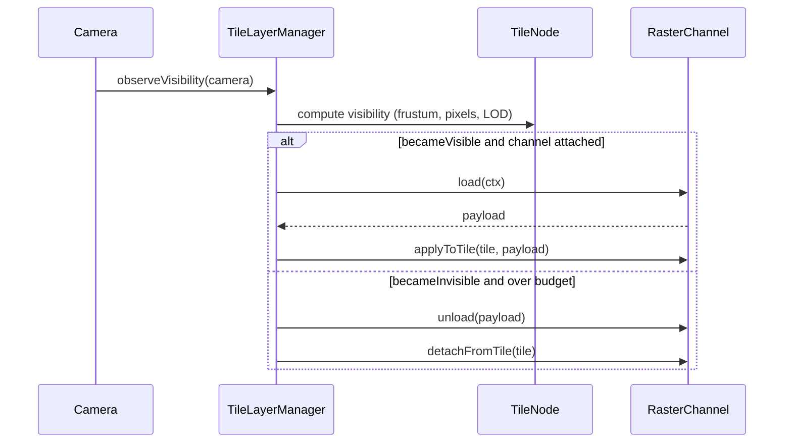

# Tile layers and raster channels

Proposed in-browser architecture for tile data flow. Replaces today's ad-hoc per-tile state — where compression, height texture, LOD, and visibility loading are tangled across [src/geo/TileLoaderUK.ts](../src/geo/TileLoaderUK.ts), [src/geo/LodUtils.ts](../src/geo/LodUtils.ts), and [src/geo/compressionExperiment.ts](../src/geo/compressionExperiment.ts) — with a small, named lifecycle for **raster channels** attached to long-lived **tile nodes**.

The type-only API skeleton lives in [src/geo/tileLayerTypes.ts](../src/geo/tileLayerTypes.ts). The manager and channel implementations are still future migration work.

## Related docs

- [docs/future-terrain.md](future-terrain.md) — overall direction, render-backend evaluation, routing / mobile sketch.
- [docs/compression-experiment.md](compression-experiment.md) — the first concrete consumer of this API.
- [docs/server-side.md](server-side.md) — where channel payloads come from (pipelines, manifests, future Zarr).

## 1. Model

A **tile node** is a long-lived three.js object placed in world space by the tile loader. Each tile node carries a small set of **raster channels** — independent data attachments such as primary height, lossy-recoded height, an aux survey raster, an aerial photo, or a coarse basemap.

Each channel is:

- **Attachable / detachable at runtime.** Channels can be added or removed without rebuilding the tile node or its geometry.
- **Lazily loaded.** No work runs for a channel on a tile that is not "visible enough" — see § _Visibility model_.
- **Unloadable.** Channels evict under working-set pressure; the tile node and its geometry survive eviction.
- **Versioned by parameters.** Each channel carries a small `params` object (e.g. `{ q: 0.05 }` for the lossy height channel). Changing the parameters invalidates only that channel; other channels on the same tile, and other tiles' instances of the same channel, are untouched if their params have not changed.

Today's [LazyTile / getTileMesh / registerCompressionTile](../src/geo/TileLoaderUK.ts) pipeline already mixes these concerns; this doc names them so they can be separated. The compression experiment has had recent UX fixes (single panel, q-slider-driven recode, visibility gating) but still runs on module-singleton state and has known DSM recode artefact bugs — see [compression-experiment.md](compression-experiment.md).

## 2. API sketch

TypeScript signatures only. No implementation in this PR; this is the target shape.

### 2.1 RasterChannel

```ts
import type * as THREE from 'three';

export interface RasterPayload {
  readonly texture: THREE.Texture;
  readonly extent: TileExtent;
  readonly uvMargin?: number;
  readonly bytes: number;
  dispose(): void;
}

export interface TileLoadContext {
  readonly tile: TileNode;
  readonly lodLevel: number;
  readonly signal: AbortSignal;
  readonly generation: number;
}

export interface RasterChannel<Params = unknown> {
  readonly id: string;
  readonly params: Params;
  load(ctx: TileLoadContext): Promise<RasterPayload>;
  unload(payload: RasterPayload): void;
  applyToTile(tile: TileNode, payload: RasterPayload): void;
  detachFromTile(tile: TileNode): void;
}
```

`AbortSignal` is mandatory. Today [compressionExperiment.ts](../src/geo/compressionExperiment.ts) uses a per-record `lossyGeneration` counter for the same purpose; this API formalises it so every channel cancels uniformly.

### 2.2 TileNode

```ts
export interface TileExtent {
  readonly eastMin: number;
  readonly eastMax: number;
  readonly northMin: number;
  readonly northMax: number;
}

export interface TileVisibility {
  readonly inFrustum: boolean;
  readonly screenPixelsApprox: number;
  readonly lodLevel: number;
  readonly working: boolean;
}

export interface RasterChannelState {
  readonly channelId: string;
  readonly status: 'idle' | 'loading' | 'ready' | 'error';
  readonly generation: number;
  readonly payload?: RasterPayload;
  readonly error?: Error;
}

export interface TileNode extends THREE.Object3D {
  readonly extent: TileExtent;
  readonly channels: ReadonlyMap<string, RasterChannelState>;
  readonly visibility: TileVisibility;
}
```

`TileNode` exposes channel state as read-only; mutation goes through the manager.

### 2.3 TileLayerManager

```ts
export interface ChannelReconciliation {
  readonly channelId: string;
  readonly visibleTiles: number;
  readonly cancelled: number;
  readonly queued: number;
}

export interface TileLayerManager {
  attachChannel(channel: RasterChannel): void;
  detachChannel(channelId: string): void;
  updateChannelParams<Params>(channelId: string, params: Params): ChannelReconciliation;
  invalidateChannel(channelId: string): ChannelReconciliation;
  observeVisibility(camera: THREE.Camera): void;
  dispose(): void;
}
```

Naming notes:

- `attachChannel` / `detachChannel` operate on the whole layer (every tile node within scope), not per-tile.
- `updateChannelParams` is the q-slider path: it returns a reconciliation summary so UI can show what just happened (how many tiles will re-load, how many were cancelled mid-flight).
- `invalidateChannel` is the manual nuclear option (e.g. after editing source data in a pipeline; see [server-side.md](server-side.md)).

### 2.4 Invariants the manager enforces

- **Visibility drives work.** A channel's `load(ctx)` is never called for a tile whose `visibility.working === false`. When a tile becomes visible, any attached channels reconcile.
- **Param-change invalidation is per-channel.** Changing `q` on `height.lossy` does not touch `height.primary`, `photo`, etc. Other tiles' `height.lossy` payloads invalidate only if their params would differ — for a global `q`, all visible tiles are affected; for per-tile params, only the affected tiles.
- **One channel per tile node, but payload sharing across LOD levels.** Multiple geometry levels of the same tile share a payload object — this is exactly the pattern already used by `uniformBags` in [src/geo/LodUtils.ts](../src/geo/LodUtils.ts).
- **Cancellation propagates.** Detaching a channel, disposing the manager, or changing params cancels any in-flight loads via the `AbortSignal` passed to `RasterChannel.load`.
- **Disposal is idempotent.** `dispose()` calls `detachFromTile` for every tile, then `unload` for every ready payload, then drops listeners.

## 3. Visibility model

The manager uses three signals to decide which channels reconcile on which tiles.

### 3.1 Frustum and culling

Today the placeholder pattern in [src/geo/TileLoaderUK.ts](../src/geo/TileLoaderUK.ts) (`LazyTile.onBeforeRender`) triggers load on first-visible draw. That is a one-shot — there is no "became invisible" event, no continuous frustum check, and no way to drop a payload when a tile leaves view. The visibility manager polls the camera frustum each frame (cheap; AABB-vs-frustum on bounding boxes the loader already maintains) and emits transitions: `becameVisible`, `becameInvisible`.

### 3.2 LOD coarseness

`GeoLOD.getCurrentLevel()` in [src/geo/LodUtils.ts](../src/geo/LodUtils.ts) already reports which of 12 mesh resolutions is selected. The manager forwards this as `TileLoadContext.lodLevel` so a channel can:

- Request a payload sized to the current LOD (a coarse channel does not need to ship a 4096² texture when the tile is rendering its level-8 mesh).
- Re-fetch when the LOD level changes by more than a configurable threshold.

### 3.3 Working-set budget

A soft cap on GPU memory across all channels. Implementation sketch:

- Each `RasterPayload.bytes` is tracked; sum across all ready payloads is the working-set size.
- When the sum crosses a configurable threshold, the manager picks the least-recently-touched payload of a non-essential channel and calls `unload` on it.
- "Non-essential" excludes the basemap (which is the visible fallback when other channels evict).
- Geometry stays — only payloads evict. A tile that loses its `height.primary` payload renders against the basemap until it next becomes visible.

This is not LRU on whole tiles; it is LRU on _channels of tiles_. Same tile can have `height.primary` evicted while `vector.tracks` remains.

## 4. Lifecycle

The two flows the manager handles. Each frame:



When channel params change (e.g. q-slider on `height.lossy`):

```mermaid
sequenceDiagram
  participant UI as UI control
  participant Mgr as TileLayerManager
  participant Tile as TileNode (visible)
  participant Off as TileNode (off-screen)
  participant Ch as RasterChannel
  UI->>Mgr: updateChannelParams('height.lossy', {q: 0.1})
  Mgr->>Mgr: cancel in-flight loads (AbortSignal)
  Mgr->>Tile: invalidate channel state
  Mgr->>Ch: load(ctx) with new params, signal
  Ch-->>Mgr: payload
  Mgr->>Ch: applyToTile(tile, payload)
  Note over Off: untouched; will load on next becomeVisible
```

The off-screen branch is the win over the original experiment behaviour (which recoded the whole loaded catalog). **Partially implemented today:** visible tiles recode via `onBeforeRender → requestVisible()` with a short alive grace; off-screen tiles are skipped until they render again. The manager-driven visibility hook in § _Migration map_ would replace the per-mesh `onBeforeRender` pattern.

## 5. Basemap morph

A **basemap** is a low-fidelity global payload that serves as the visible fallback whenever per-tile channels have not yet loaded. The user pans across the country, sees the basemap continuously, and watches detailed DSM tiles "morph in" as they finish loading.

Sketch:

- Channel `id = 'basemap'`. Attached at startup; never evicted.
- Source: a pre-encoded HTJ2K thumbnail, a rasterised OS Terr50 mesh, or a small grid of basemap chunks. Source choice is left open; the channel sees only the result.
- Tile materials sample basemap as a fallback height / photo source when the per-tile channels have not yet loaded.
- Crossfade is controlled by a per-tile `t` uniform driven by channel state (loaded ratio), reusing the global uniform pattern in [src/geo/tileShaderRuntime.ts](../src/geo/tileShaderRuntime.ts).

### 5.1 Overlap (apron / skirt) for seamlessness

If the basemap is delivered as multiple chunks rather than a single global texture, each chunk is pre-baked with an **apron** of pixels past its nominal bounds (e.g. a 1–2 % margin on each side, exact figure TBD against the chosen encoder). The apron buys two distinct things:

- **Clean sampling at chunk edges.** Bilinear / anisotropic sampling near a chunk's nominal edge does not bleed from a neighbour's compressed data — the chunk has its own clean samples right up to the apron edge.
- **A cross-fade band.** A small overlap region where adjacent chunks are mixed in the shader hides seams produced by per-chunk HTJ2K quantisation (block edges, ringing) without requiring matched encoder state across chunks.

Implications for this doc's API:

- `RasterPayload.uvMargin` (or equivalent extent in metres) is set on overlapped channels. `applyToTile` uses it to configure sampler UV transforms so the shader can address the apron explicitly.
- The basemap bake (offline) needs to know the chunk grid and the apron size; both go in the chunk manifest (see [server-side.md](server-side.md) § _Data-processing pipelines_).
- The same overlap mechanic is a candidate for the regular `height.primary` DSM / DTM tiles later, where current OSGB grid boundaries are hard-edged at the catalog metadata extents. Listed as future work, not in scope of the basemap channel itself.

### 5.2 Storage format is provisional

The chunk-files + JSON-manifest layout sketched above is the simplest path. A likely future direction is moving the rasters into a **Zarr** store, at which point the apron mechanic and the choice of HTJ2K as codec need re-evaluation. That evaluation lives in [server-side.md](server-side.md) § _Storage format evolution (Zarr evaluation)_; the channel-level API in this doc is intentionally agnostic to storage — the channel sees a payload, not a file layout.

## 6. Example channels (future)

A short catalogue showing the abstraction is wide enough to subsume current and planned use:

| Channel id | Source | Notes |
|------------|--------|-------|
| `height.primary` | DEFRA DSM (1 m), DEFRA DTM (10 m) | Today's `heightFeild` uniform becomes a channel payload. |
| `height.lossy` | HTJ2K runtime recode of `height.primary` | The current compression experiment as a channel; see [compression-experiment.md](compression-experiment.md). |
| `height.aux.firstMinusLast` | Pre-baked first-return − last-return DSM diff (see [future-terrain.md](future-terrain.md) § _Auxiliary height channels_) | Real survey signal; coarser than primary. |
| `photo.aerial` | Future aerial / orthophoto provider | Pure imagery channel; uses same lifecycle. |
| `photo.historical` | Future historical imagery | Same shape; different time slice. |
| `vector.tracks` | GPX catalog (see [server-side.md](server-side.md)) | Tracks become a channel too, not a separate bespoke layer. Removes the special-case `TrackVis` plumbing in `TileLoaderUK.ts`. |
| `feature.internal` | Authoring artefacts ("artefacts representing internal features") | Whatever the user chooses to attach as private annotation. |
| `basemap` | Global fallback (see § _Basemap morph_) | Singleton; never evicted. |

Convention: dotted ids namespace channels by data family so manager-level operations ("detach all `height.*`") are trivial.

## 7. Migration map

How current modules map onto the new model. No code changes in this PR; this is the target for follow-up PRs (sequenced in [compression-experiment.md](compression-experiment.md) § _Migration plan_).

| Current | New role |
|---------|----------|
| `TerrainRenderer` in [src/geo/TileLoaderUK.ts](../src/geo/TileLoaderUK.ts) | Split into `TileLayerManager` (channel orchestration) + a slim `TerrainScene` (the three.js scene + layer-group bookkeeping). |
| `getTileMesh` in [src/geo/LodUtils.ts](../src/geo/LodUtils.ts) | Produces a bare `TileNode` (geometry + LOD only). The current bundling of height-texture + uniforms into the mesh moves into the `height.primary` channel's `applyToTile`. |
| `LazyTile.onBeforeRender` in [src/geo/TileLoaderUK.ts](../src/geo/TileLoaderUK.ts) | Replaced by `TileLayerManager.observeVisibility(camera)` driven from the render loop, with explicit `becameVisible` / `becameInvisible` transitions. |
| `registerCompressionTile` in [src/geo/compressionExperiment.ts](../src/geo/compressionExperiment.ts) | Gone. Replaced by attaching a `RasterChannel<{ q: number }>` factory once, at experiment-enable time. |
| Module-singleton state in [src/geo/compressionExperiment.ts](../src/geo/compressionExperiment.ts) (`trackedTiles`, `loadStatus`, `recodeReport`) | Lives on the channel and the manager; no module globals, so two `TerrainRenderer`s can coexist and HMR is not racing a singleton. |
| `TileUniformBag` in [src/geo/tileShaderRuntime.ts](../src/geo/tileShaderRuntime.ts) | Stays — it remains the right way to bind per-tile uniforms into the shader. `applyToTile` writes into it. |
| Track loading via `TrackVis` in [src/geo/TileLoaderUK.ts](../src/geo/TileLoaderUK.ts) | Optionally re-shaped as a `vector.tracks` channel. Deferred; tracks are not a raster and need their own thinking before forcing them into this API. |

Dead code that is adjacent and should die during migration but is not the API's concern: `renderMip()`'s early return ([src/geo/LodUtils.ts](../src/geo/LodUtils.ts)), `if (false && lod <= 3)` sub-tile split ([src/geo/LodUtils.ts](../src/geo/LodUtils.ts)), `planeBaseTest()` ([src/geo/TileLoaderUK.ts](../src/geo/TileLoaderUK.ts)), `LazyTileOS.rasterize` stub ([src/geo/TileLoaderUK.ts](../src/geo/TileLoaderUK.ts)).
